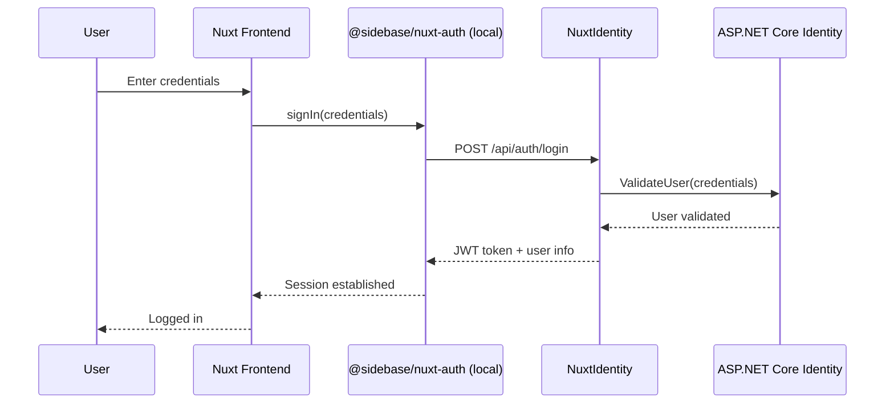

# Nuxt Identity

The **Nuxt Identity** project aims to be the .NET developer's companion to [@sidebase/nuxt-auth](https://auth.sidebase.io/). If you're developing a web application with a Nuxt frontend, and a .NET backend, the **Nuxt Identity** project will provide .NET libraries you can add to your application to get started quickly. Built on ASP.NET Core Identity, this project bridges the gap between .NET and Nuxt for auth and identity. 

## Why?

Why are we doing this instead of using something that's already out there?

- 🎯 **Specific niche:** .NET Identity works great, but it doesn't "speak nuxt-auth" out of the box
- 🧹 **Reduces boilerplate:** Developers won't need to figure out JWT token formats, refresh token flows, and endpoint structures that nuxt-auth expects
- 🔌 **Pre-configured endpoints:** Will provide drop-in-ready API controllers that match what nuxt-auth providers expect
- 🔒 **Type safety bridge:** Will include TypeScript types for the frontend that match the backend .NET models

## Features

Nuxt Identity aims to be a thin library, focused on moving data between .NET Identity
and @sidebase/nuxt-auth. Here's what it's doing:

- 🔐 **JWT handling**: Setting up JWT token creating and validation with security best practices.
- 🔌 **API endpoints**: Supplying the expected endpoints, translating those requests into .NET Identity system calls, and returning the results in the expected form.
- ⚠️ **Error handling**: Surfacing RFC 7807 compliant error responses with ProblemDetails middleware for better API consistency.
- 📊 **Structured logging**: High-performance logging for authentication events and troubleshooting.
- 👤 **Role/claim visibility**: Surfacing user's roles and claims in auth tokens and in the user session.
- 🔄 **Refresh tokens**: .NET Identity doesn't handle refresh tokens at all, so a big part of this libraries work is storing and validating those with automatic rotation.
- 🔑 **Password management**: Forgot-password, reset-password, and change-password flows, built on ASP.NET Core Identity's token-based password reset. Consumers provide their own notification delivery via `IUserNotifier<TUser>`.

## High-Level Flow

## What's coming?

- 📦 **NuGet packages** developers can drop in
- 🔌 **Pre-built endpoints** matching nuxt-auth's credential/refresh token providers
- 📚 **Clear examples** for both .NET and Nuxt sides
- ⚡ **Minimal config** - sensible defaults that "just work"
- 🔐 **Security best practices** baked in
