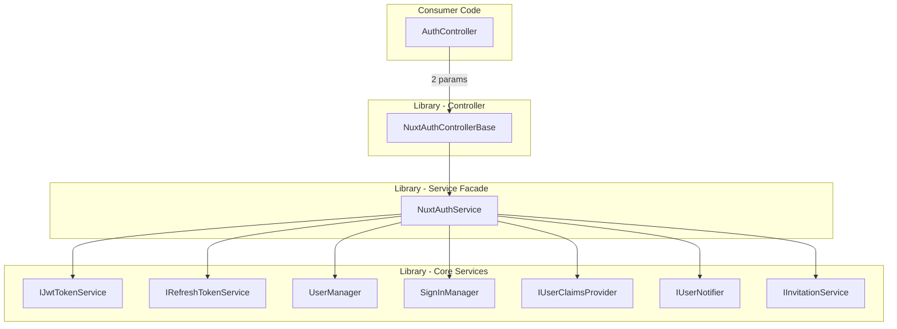

# Design: Service Facade for NuxtAuthControllerBase

## Problem Statement

`NuxtAuthControllerBase<TUser>` has 8 constructor parameters and growing. Every time a new feature is added (e.g., invitations, password management, user notifications), a new dependency is added to the constructor, which **breaks every downstream consumer** because they must update their constructor signatures to pass through the new parameter.

Current constructor signature (8 parameters):

```csharp
public abstract partial class NuxtAuthControllerBase<TUser>(
    IJwtTokenService<TUser> jwtTokenService,
    IEnumerable<IUserClaimsProvider<TUser>> claimsProviders,
    IRefreshTokenService refreshTokenService,
    UserManager<TUser> userManager,
    SignInManager<TUser> signInManager,
    IEnumerable<IUserNotifier<TUser>> userNotifiers,
    IEnumerable<IInvitationService> invitationServices,
    ILogger logger) : ControllerBase
```

Consumer impact — every consumer must mirror all 8 parameters:

```csharp
public class AuthController(
    IJwtTokenService<IdentityUser> jwtTokenService,
    IEnumerable<IUserClaimsProvider<IdentityUser>> userClaimsProviders,
    IRefreshTokenService refreshTokenService,
    UserManager<IdentityUser> userManager,
    SignInManager<IdentityUser> signInManager,
    IEnumerable<IUserNotifier<IdentityUser>> userNotifiers,
    IEnumerable<IInvitationService> invitationServices,
    ILogger<AuthController> logger)
    : NuxtAuthControllerBase<IdentityUser>(
        jwtTokenService, userClaimsProviders, refreshTokenService,
        userManager, signInManager, userNotifiers, invitationServices, logger)
```

## Goals

1. **Stop breaking consumers** when new dependencies are added to the library
2. **Keep shared logic DRY** — helper methods remain accessible to the controller
3. **Preemptively restructure routes** — move password endpoints to `api/auth/password/*` now, so a future controller split is painless
4. **Keep single controller** — consumers continue to derive from one base class

## Non-Goals

- Splitting into multiple controller base classes (ruled out for now — adds consumer burden without sufficient benefit; route restructuring prepares for this if needed later)

## Design

### Architecture Overview



### Service Facade: `NuxtAuthService<TUser>`

A single service that aggregates all dependencies. The controller takes **two parameters** (`NuxtAuthService` + `ILogger`) instead of eight. New dependencies are added to the service facade without breaking consumers.

```csharp
// Registered in DI by AddNuxtIdentity<TUser>()
public class NuxtAuthService<TUser> where TUser : IdentityUser, new()
{
    public NuxtAuthService(
        IJwtTokenService<TUser> jwtTokenService,
        IEnumerable<IUserClaimsProvider<TUser>> claimsProviders,
        IRefreshTokenService refreshTokenService,
        UserManager<TUser> userManager,
        SignInManager<TUser> signInManager,
        IEnumerable<IUserNotifier<TUser>> userNotifiers,
        IEnumerable<IInvitationService> invitationServices);

    // Expose as properties for controller access
    public IJwtTokenService<TUser> JwtTokenService { get; }
    public IRefreshTokenService RefreshTokenService { get; }
    public UserManager<TUser> UserManager { get; }
    public SignInManager<TUser> SignInManager { get; }
    public IEnumerable<IUserClaimsProvider<TUser>> ClaimsProviders { get; }
    public IEnumerable<IUserNotifier<TUser>> UserNotifiers { get; }
    public IInvitationService? InvitationService { get; }

    // Shared helper methods (moved from controller)
    public Task<LoginResponse> CreateLoginResponseAsync(TUser user);
    public Task<RefreshResponse> CreateRefreshResponseAsync(TUser user, string oldRefreshToken);
    public Task<UserInfo> CreateUserInfoAsync(TUser user);
    public Task<TUser?> GetUserByIdAsync(string userId);
    public Task<TUser?> FindUserByUsernameOrEmailAsync(string? username, string? email);
}
```

**Key benefit:** When a new feature needs `IFooService`, it gets added to `NuxtAuthService<TUser>` — no consumer constructors change.

### Refactored Controller

The controller signature shrinks to 2 parameters:

```csharp
[ApiController]
[Route("api/auth")]
public abstract partial class NuxtAuthControllerBase<TUser>(
    NuxtAuthService<TUser> authService,
    ILogger logger) : ControllerBase
    where TUser : IdentityUser, new()
{
    protected NuxtAuthService<TUser> AuthService { get; } = authService;

    // Convenience accessors (optional, for backward compatibility in overrides)
    protected UserManager<TUser> UserManager => AuthService.UserManager;
    protected SignInManager<TUser> SignInManager => AuthService.SignInManager;
    // etc.
}
```

### Consumer Experience — Before and After

**Before (8 parameters, breaks on every new feature):**

```csharp
public class AuthController(
    IJwtTokenService<IdentityUser> jwtTokenService,
    IEnumerable<IUserClaimsProvider<IdentityUser>> userClaimsProviders,
    IRefreshTokenService refreshTokenService,
    UserManager<IdentityUser> userManager,
    SignInManager<IdentityUser> signInManager,
    IEnumerable<IUserNotifier<IdentityUser>> userNotifiers,
    IEnumerable<IInvitationService> invitationServices,
    ILogger<AuthController> logger)
    : NuxtAuthControllerBase<IdentityUser>(
        jwtTokenService, userClaimsProviders, refreshTokenService,
        userManager, signInManager, userNotifiers, invitationServices, logger)
{ }
```

**After (2 parameters, stable across releases):**

```csharp
public class AuthController(
    NuxtAuthService<IdentityUser> authService,
    ILogger<AuthController> logger)
    : NuxtAuthControllerBase<IdentityUser>(authService, logger)
{ }
```

### DI Registration

The `AddNuxtIdentity<TUser>()` extension method registers the service facade:

```csharp
public static IServiceCollection AddNuxtIdentity<TUser>(this IServiceCollection services)
    where TUser : IdentityUser, new()
{
    // Existing registrations
    services.AddScoped<IUserClaimsProvider<TUser>, IdentityUserClaimsProvider<TUser>>();
    services.AddScoped<IJwtTokenService<TUser>, JwtTokenService<TUser>>();

    // New: register the service facade
    services.AddScoped<NuxtAuthService<TUser>>();

    return services;
}
```

### File Organization

The existing partial class file split is retained:

| File | Contents |
|------|----------|
| `NuxtAuthControllerBase.cs` | Class declaration, properties, hooks |
| `NuxtAuthControllerBase.Auth.cs` | Authentication endpoints |
| `NuxtAuthControllerBase.Password.cs` | Password management endpoints |
| `NuxtAuthControllerBase.Log.cs` | LoggerMessage declarations |

### Hook Methods

The virtual hook methods remain on the controller — they are controller concerns:

- `OnUserCreatedAsync(TUser user)` — triggered by SignUp
- `OnInvitationAcceptedAsync(TUser user, InvitationEntity invitation)` — triggered by invitation SignUp
- `OnUserConfirmedAsync(TUser user)` — placeholder for email confirmation

### What Moves to the Service

| Item | From | To |
|------|------|-----|
| `CreateLoginResponseAsync()` | Controller | Service |
| `CreateRefreshResponseAsync()` | Controller | Service |
| `CreateUserInfoAsync()` | Controller | Service |
| `GetUserByIdAsync()` | Controller | Service |
| `FindUserByUsernameOrEmailAsync()` | Controller | Service |
| `ValidateInvitationForSignup()` | Controller | Service |
| `AssignInvitationRolesAsync()` | Controller | Service |
| `AssignInvitationClaimsAsync()` | Controller | Service |
| `ToBase64Url()` / `FromBase64Url()` | Controller | Service |
| `InvitationService` resolution logic | Controller constructor | Service constructor |

### What Stays on the Controller

| Item | Reason |
|------|--------|
| Endpoint methods (Login, SignUp, etc.) | HTTP concern |
| `RegistrationOptions` virtual property | Controls endpoint behavior |
| Hook methods (OnUserCreated, etc.) | Override points for consumers |
| LoggerMessage declarations | Tied to controller logging |
| `GetCurrentUserId()` / `GetCurrentUsername()` | Uses `ControllerBase.User` |

## Route Changes

Preemptively restructure password routes to `api/auth/password/*` to prepare for a potential future controller split. This is done by using absolute route templates on the password endpoint attributes:

| Endpoint | Before | After |
|----------|--------|-------|
| Forgot Password | `POST api/auth/forgot-password` | `POST api/auth/password/forgot` |
| Reset Password | `POST api/auth/reset-password` | `POST api/auth/password/reset` |
| Change Password | `POST api/auth/change-password` | `POST api/auth/password/change` |

Implementation — change the `[HttpPost]` attributes in `NuxtAuthControllerBase.Password.cs`:

```csharp
// Before
[HttpPost("forgot-password")]

// After — use absolute route to override class-level [Route] prefix
[HttpPost("/api/auth/password/forgot")]
```

This is a **breaking API change**, acceptable because the library is pre-1.0.

## Implementation Plan

### Phase 1: Create Service Facade

1. Create `NuxtAuthService<TUser>` in `src/AspNetCore/Services/`
2. Move shared helper methods from controller to service
3. Move `InvitationService` resolution logic to service constructor
4. Register in `AddNuxtIdentity<TUser>()`
5. Add unit tests for the service facade in `tests/NuxtIdentity.AspNetCore.Tests/Services/`

### Phase 2: Refactor Controller and Routes

6. Change `NuxtAuthControllerBase<TUser>` to accept `NuxtAuthService<TUser>` + `ILogger`
7. Add convenience property accessors (e.g., `UserManager => AuthService.UserManager`)
8. Update endpoint methods to call `AuthService.CreateLoginResponseAsync()` etc.
9. Change password endpoint routes to `api/auth/password/*`
10. Update all test helpers (`TestAuthController`, `InvitationOnlyTestAuthController`)
11. Update playground consumer (`playground/local/Controllers/AuthController.cs`)
12. Update sample consumer (`samples/Local/Backend/Controllers/AuthController.cs`)
13. Update `NuxtIdentity.Playground.Local.http` with new password routes
14. Verify all existing tests pass

### Phase 3: Documentation

15. Update XML documentation on all changed classes
16. Update README files that reference the constructor pattern or routes
17. Update playground and sample documentation

## Decisions

1. **Single facade** — All dependencies go into one `NuxtAuthService<TUser>`. Controllers only need the facade + logger.
2. **Single controller** — Keep one `NuxtAuthControllerBase<TUser>` with partial class files. Splitting into multiple controllers adds consumer burden without sufficient benefit.
3. **Preemptive route restructuring** — Password routes change to `api/auth/password/*` now, preparing for a potential future controller split. Breaking change is acceptable pre-1.0.
4. **Clean break** — No deprecated constructor overload. Pre-1.0 library; consumers update their constructors directly.
5. **Convenience accessors** — The controller provides shortcut properties like `UserManager` that delegate to `AuthService.UserManager`, keeping endpoint code readable.
