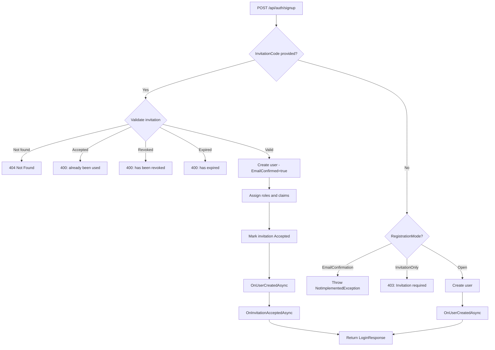

# Design Document: Registration — Phase 1

## Overview

This document describes the changes needed to implement Phase 1 of the Registration feature: invitation-based registration with lifecycle hooks. It covers PRD stories 1, 2, 3, 4, 5, and 10.

Phase 1 adds:
- An `InvitationEntity` model and `InvitationStatus` enum for invitation persistence
- An `IInvitationService` interface for invitation lifecycle management
- An `EfInvitationService` EF Core implementation
- A `RegistrationMode` enum and `RegistrationOptions` property on the base controller
- Extended `SignUp` endpoint to accept invitation codes
- A new `GET /api/auth/invitations/{code}` validation endpoint
- New lifecycle hooks: `OnInvitationAcceptedAsync` and `OnUserConfirmedAsync`

All new controller methods are `virtual`, following the existing pattern in [`NuxtAuthControllerBase`](../../src/AspNetCore/Controllers/NuxtAuthControllerBase.cs).

---

## Component Changes

### 1. InvitationStatus Enum

**File**: `src/Core/Models/InvitationStatus.cs` (new)

Represents the lifecycle state of an invitation: `NotFound`, `Pending`, `Accepted`, `Expired`, `Revoked`.

`NotFound` is included in the enum (rather than being a null/missing concept) because the `GET /api/auth/invitations/{code}` endpoint returns status for all cases including unknown codes (Story 3). This is a semantic distinction — the endpoint always succeeds in answering "what is the status of this code?"

---

### 2. RegistrationMode Enum and RegistrationOptions

**File**: `src/Core/Models/RegistrationModels.cs` (new)

`RegistrationMode` enum controls how user registration behaves:
- `Open` — Anyone can register, no email confirmation required (default for Phase 1)
- `EmailConfirmation` — Anyone can register but must confirm email (**Phase 3 — not implemented yet**)
- `InvitationOnly` — Invitation code required to register, email auto-confirmed

`RegistrationOptions` is a record with a single `Mode` property defaulting to `Open`. The controller exposes this as a virtual property that developers override to change registration behavior.

**Phase 1 limitation**: If a developer sets `Mode = EmailConfirmation`, the `SignUp` endpoint throws `NotImplementedException` with a message indicating email confirmation is not yet supported. This prevents silent misbehavior — the developer gets an immediate, clear signal rather than the system quietly skipping email confirmation. The default is `Open` (not `EmailConfirmation`) in Phase 1 to avoid this trap. When Phase 3 is implemented, the default will change to `EmailConfirmation` per the PRD.

These are placed in Core because the controller (in AspNetCore) needs them, and future service implementations may also reference `RegistrationMode`. Following the same pattern as [`AuthModels.cs`](../../src/Core/Models/AuthModels.cs) which is in Core but consumed by the controller.

---

### 3. InvitationEntity

**File**: `src/Core/Models/InvitationEntity.cs` (new)

Represents an invitation to register for the application.

**Properties**:
- `Id` (int, auto-generated) — Safe-to-log identifier. Per PRD business rule, `Code` is a secret, so `Id` is used in all diagnostic logging, following the `RefreshTokenEntity.Key` pattern
- `Code` (Guid) — Unique invitation code. Stored as `Guid` for type safety and efficient indexing
- `Email` (string) — Email address of the invited user
- `Status` (InvitationStatus) — Current lifecycle state. `NotFound` (0) is never stored; it is only used in API responses
- `Roles` (string?) — JSON-serialized list of role names to assign on acceptance
- `Claims` (string?) — JSON-serialized list of `ClaimInfo` type/value pairs to assign on acceptance
- `Metadata` (string?) — Optional JSON string with application-specific data. NuxtIdentity stores and delivers this but does not interpret it
- `CreatedAt`, `ExpiresAt` (DateTime) — Creation and expiration timestamps
- `AcceptedAt` (DateTime?) — When the invitation was accepted
- `AcceptedByUserId` (string?) — User ID of the registrant

Roles and Claims are stored as JSON strings rather than separate join tables, keeping the schema simple. The library stores and delivers this data without complex querying needs.

---

### 4. Request/Response Model Changes

**File**: [`src/Core/Models/AuthModels.cs`](../../src/Core/Models/AuthModels.cs)

**Extend `SignUpRequest`**: Add an optional `InvitationCode` property (string?). This is backward-compatible — existing consumers that don't send it will have it defaulted to `null`.

**New `InvitationStatusResponse`**: A response record for the invitation validation endpoint with:
- `Status` (InvitationStatus) — The lifecycle status of the invitation code
- `Email` (string?) — The invitation email, returned only for `Pending` status so the frontend can pre-fill the registration form. Null for all other statuses to avoid information leakage

---

### 5. IInvitationService Interface

**File**: `src/Core/Abstractions/IInvitationService.cs` (new)

Service for managing invitation lifecycle. The developer injects this into their own admin controller to build invitation management endpoints with their own authorization.

```csharp
public interface IInvitationService
{
    Task<InvitationEntity> CreateAsync(string email, IReadOnlyList<string> roles,
        IReadOnlyList<ClaimInfo> claims, TimeSpan expiresIn, string? metadata = null);

    Task<InvitationEntity?> GetByCodeAsync(string code);

    Task<InvitationStatus> ResolveStatusAsync(string code);

    Task<InvitationEntity?> ValidateAsync(string code);

    Task AcceptAsync(InvitationEntity invitation, string userId);
}
```

Design decisions:
- `CreateAsync` uses `ClaimInfo` from the existing [`AuthModels.cs`](../../src/Core/Models/AuthModels.cs)
- `ResolveStatusAsync` returns the effective status accounting for both stored status and time-based expiration. Needed by the `GET /api/auth/invitations/{code}` endpoint — avoids duplicating expiration logic in the controller
- `ValidateAsync` returns the entity when usable (pending + not expired), or null. Used by the SignUp endpoint
- `AcceptAsync` is split from `ValidateAsync` to give the controller control over when acceptance happens (after user creation succeeds). This avoids combining side effects with validation
- `ListAsync` and `RevokeAsync` from the PRD are deferred to Phase 2 (Stories 6, 7). The interface covers only Phase 1 needs
- The `code` parameter is `string` (not `Guid`) at the interface boundary. The implementation parses it and returns null/NotFound for invalid formats

---

### 6. EfInvitationService

**File**: `src/EntityFrameworkCore/Services/EfInvitationService.cs` (new)

Entity Framework Core implementation of `IInvitationService`, following the pattern of [`EfRefreshTokenService`](../../src/EntityFrameworkCore/Services/EfRefreshTokenService.cs). Generic on `TContext : DbContext`.

Constructor takes `TContext`, `ILogger`, and optional `TimeProvider` (defaults to `TimeProvider.System` for testability).

**Key implementation details**:
- `CreateAsync` uses `Guid.NewGuid()` directly — no hashing needed unlike refresh tokens, because invitation codes are stored as-is (they need to be looked up by exact match and returned to the admin who created them). Roles and Claims are serialized with `JsonSerializer`
- `GetByCodeAsync` parses the string to Guid, returns null for invalid formats
- `GetEffectiveStatus` is a private helper that computes effective status: terminal states (Accepted, Revoked) return as-is; Pending invitations past `ExpiresAt` return `Expired`. Expiration is computed at read time rather than stored via a background job, matching the `EfRefreshTokenService` pattern
- All log messages reference `Id` (int), never `Code` (Guid), per PRD security rule

---

### 7. ModelBuilder Extensions

**File**: [`src/EntityFrameworkCore/Extensions/ModelBuilderExtensions.cs`](../../src/EntityFrameworkCore/Extensions/ModelBuilderExtensions.cs)

Add `ConfigureNuxtIdentityInvitations` method following the existing [`ConfigureNuxtIdentityRefreshTokens`](../../src/EntityFrameworkCore/Extensions/ModelBuilderExtensions.cs:32) pattern.

Configuration:
- Primary key on `Id`
- Unique index on `Code` (primary query path)
- Indexes on `Email` and `Status` (useful for Phase 2 admin queries)
- `Email` max length 256 (matches ASP.NET Identity default)
- `Roles`, `Claims`, `Metadata` max length 4000 to prevent unbounded growth
- `Code`, `Email`, `Status`, `CreatedAt`, `ExpiresAt` marked as required

---

### 8. ServiceCollection Extensions

**File**: [`src/EntityFrameworkCore/Extensions/ServiceCollectionExtensions.cs`](../../src/EntityFrameworkCore/Extensions/ServiceCollectionExtensions.cs)

Register `EfInvitationService<TContext>` as `IInvitationService` in `AddNuxtIdentityEntityFramework`, alongside the existing `EfRefreshTokenService` registration. Scoped lifetime (same as `EfRefreshTokenService`) because it depends on a scoped `DbContext`.

---

### 9. Controller Changes

**File**: [`src/AspNetCore/Controllers/NuxtAuthControllerBase.cs`](../../src/AspNetCore/Controllers/NuxtAuthControllerBase.cs)

#### 9.1. New Constructor Parameter

Add `IEnumerable<IInvitationService> invitationServices` to the primary constructor, following the existing `IEnumerable<IUserNotifier<TUser>>` pattern for optional services. Expose as `protected IInvitationService? InvitationService` property (using `.FirstOrDefault()`).

Consumers who don't use EF Core may not have an `IInvitationService` registered. Using `IEnumerable` avoids startup failures while the invitation endpoints throw a descriptive `NuxtIdentityConfigurationException` at runtime if the service is needed but missing.

**Fix for IUserNotifier fan-out**: The existing `UserNotifier` property calls `.FirstOrDefault()`, meaning only the first registered `IUserNotifier` is called. This should be changed to iterate all registered notifiers. The controller should store the full `IEnumerable<IUserNotifier<TUser>>` and call all implementations in `ForgotPassword` (and future endpoints). This is a bug fix to the existing password management implementation that should be included in this phase. For example, a consumer might register both an email notifier and an audit-log notifier.

`IInvitationService` is different — it's a stateful data service (not a fan-out notification), so exactly zero or one instance is expected. The constructor should validate that at most one is registered and throw a `NuxtIdentityConfigurationException` with a clear message (e.g., "Multiple IInvitationService implementations registered. Only one invitation store is supported.") if more than one is found. Store the single instance (or null) in the `InvitationService` property.

#### 9.2. RegistrationOptions Virtual Property

A `protected virtual RegistrationOptions RegistrationOptions` property returning `new()` (defaults to `Open` mode in Phase 1). Developers override this to switch to `InvitationOnly`.

#### 9.3. Refactored SignUp Endpoint

The existing `SignUp` method is refactored into a dispatcher:
1. If `Mode == EmailConfirmation` → throw `NotImplementedException` (not yet supported)
2. If `InvitationCode` is provided → delegate to private `SignUpWithInvitationAsync`
3. If no code and `Mode == InvitationOnly` → return 403 Forbidden with "invitation required"
4. Otherwise (`Open` mode) → delegate to private `SignUpOpenAsync` (existing behavior extracted)

`SignUpOpenAsync` preserves exactly the current open registration logic.

`SignUpWithInvitationAsync` handles the invitation flow:
1. Verify `IInvitationService` is registered (throw `NuxtIdentityConfigurationException` if not)
2. Look up invitation by code — return 404 if not found
3. Check status for specific error messages per Story 2: Accepted → 400 "already been used", Revoked → 400 "revoked", Expired → 400 "expired"
4. Create user with `EmailConfirmed = true` (auto-confirm per PRD Business Rule 3)
5. Assign roles and claims from invitation via `UserManager.AddToRolesAsync`/`AddClaimsAsync`
6. Mark invitation as accepted via `InvitationService.AcceptAsync`
7. Call `OnUserCreatedAsync`, then `OnInvitationAcceptedAsync`
8. Return `LoginResponse`

Add `ProducesResponseType` attributes for 403 Forbidden and 404 Not Found to the `SignUp` method.

**Role/claim assignment note**: Assignment errors are logged as warnings but do not fail registration. The user is already created at this point — failing the entire operation would leave the system in an inconsistent state. `UserManager.AddToRolesAsync` requires roles to exist in the Identity role store; invalid roles are a runtime data issue that the admin controller should validate during invitation creation.

#### 9.4. ValidateInvitation Endpoint (Story 3)

New `GET /api/auth/invitations/{code}` virtual endpoint. Always returns 200 OK with `InvitationStatusResponse`. Does not require authentication. Delegates status resolution to `InvitationService.ResolveStatusAsync`. Returns `Email` only for Pending status.

#### 9.5. New Lifecycle Hooks (Story 10)

Two new virtual methods with no-op default implementations:
- `OnInvitationAcceptedAsync(TUser user, InvitationEntity invitation)` — called after invitation signup with roles/claims assigned
- `OnUserConfirmedAsync(TUser user)` — added as a no-op placeholder for Phase 3. Adding it now prevents a breaking change later

---

## Registration Flow



---

## Test Infrastructure Updates

### TestAuthController

Update constructor to accept the new `IEnumerable<IInvitationService>` parameter, passing through to base.

### TestDbContext (both test projects)

Add `ConfigureNuxtIdentityInvitations` call in `OnModelCreating`. The EF Core test context also needs a `DbSet<InvitationEntity>` property.

### TestWebApplicationFactory

Seed Identity roles (`admin`, `user`) after database creation for invitation role assignment tests. No new DI registrations needed — `EfInvitationService` is registered by `AddNuxtIdentityEntityFramework`.

### InvitationOnly Mode Testing

Story 4 requires testing `InvitationOnly` registration mode. Since `RegistrationOptions` is a virtual property override (not a DI-configurable option), this requires:
- `InvitationOnlyTestAuthController` — subclass that overrides `RegistrationOptions` with `Mode = InvitationOnly`
- `InvitationOnlyTestWebApplicationFactory` — factory that registers this controller

---

## Testing Strategy

### EfInvitationService Tests (~21 tests)

**File**: `tests/NuxtIdentity.EntityFrameworkCore.Tests/Services/EfInvitationServiceTests.cs` (new)

Following the pattern of [`EfRefreshTokenServiceTests`](../../tests/NuxtIdentity.EntityFrameworkCore.Tests/Services/EfRefreshTokenServiceTests.cs). Covers:
- `CreateAsync`: code generation, persistence, status is Pending, role/claim serialization, metadata storage, expiration calculation
- `GetByCodeAsync`: existing code, nonexistent code, invalid GUID format
- `ResolveStatusAsync`: each status (Pending, Accepted, Revoked, Expired, NotFound)
- `ValidateAsync`: pending/valid returns entity, expired/accepted/revoked/unknown returns null
- `AcceptAsync`: status change, AcceptedAt and AcceptedByUserId set

### Controller Integration Tests (~17 tests)

**File**: [`tests/NuxtIdentity.AspNetCore.Tests/Controllers/NuxtAuthControllerTests.cs`](../../tests/NuxtIdentity.AspNetCore.Tests/Controllers/NuxtAuthControllerTests.cs)

**SignUp with Invitation** (Stories 1, 2): Valid invitation returns tokens, roles assigned, claims assigned, invitation marked accepted, email auto-confirmed, unknown code → 404, accepted code → 400, expired code → 400, revoked code → 400, signup without code still works

**ValidateInvitation** (Story 3): Pending → status + email, Accepted → status only, Expired → status only, Revoked → status only, Unknown → NotFound status

**InvitationOnly Mode** (Story 4): Without code → 403, with valid code → 200

### ModelBuilder and ServiceCollection Tests (~4 tests)

Add to existing test files: invitation table creation, unique Code index, round-trip store/retrieve, `IInvitationService` registration resolves.

---

## Files to Modify

| File | Type of Change |
|------|----------------|
| `src/Core/Models/InvitationStatus.cs` | New file — enum |
| `src/Core/Models/RegistrationModels.cs` | New file — enum + record |
| `src/Core/Models/InvitationEntity.cs` | New file — entity class |
| `src/Core/Models/AuthModels.cs` | Add `InvitationCode` to `SignUpRequest`, add `InvitationStatusResponse` |
| `src/Core/Abstractions/IInvitationService.cs` | New file — interface |
| `src/EntityFrameworkCore/Services/EfInvitationService.cs` | New file — EF implementation |
| `src/EntityFrameworkCore/Extensions/ModelBuilderExtensions.cs` | Add `ConfigureNuxtIdentityInvitations` |
| `src/EntityFrameworkCore/Extensions/ServiceCollectionExtensions.cs` | Register `EfInvitationService` |
| `src/AspNetCore/Controllers/NuxtAuthControllerBase.cs` | Constructor param, RegistrationOptions, refactored SignUp, ValidateInvitation, hooks, logger messages |
| `tests/NuxtIdentity.AspNetCore.Tests/Helpers/TestAuthController.cs` | Update constructor |
| `tests/NuxtIdentity.AspNetCore.Tests/Helpers/TestDbContext.cs` | Add invitation configuration |
| `tests/NuxtIdentity.AspNetCore.Tests/Helpers/TestWebApplicationFactory.cs` | Seed roles |
| `tests/NuxtIdentity.AspNetCore.Tests/Helpers/InvitationOnlyTestAuthController.cs` | New file |
| `tests/NuxtIdentity.AspNetCore.Tests/Helpers/InvitationOnlyTestWebApplicationFactory.cs` | New file |
| `tests/NuxtIdentity.AspNetCore.Tests/Controllers/NuxtAuthControllerTests.cs` | Add ~17 integration tests |
| `tests/NuxtIdentity.EntityFrameworkCore.Tests/Helpers/TestDbContext.cs` | Add Invitations DbSet + config |
| `tests/NuxtIdentity.EntityFrameworkCore.Tests/Services/EfInvitationServiceTests.cs` | New file — ~21 tests |
| `tests/NuxtIdentity.EntityFrameworkCore.Tests/Extensions/ModelBuilderExtensionsTests.cs` | Add ~3 tests |
| `tests/NuxtIdentity.EntityFrameworkCore.Tests/Extensions/ServiceCollectionExtensionsTests.cs` | Add 1 test |

## Files NOT Modified

| File | Reason |
|------|--------|
| `src/Core/Abstractions/IUserNotifier.cs` | `SendEmailConfirmationAsync` already exists for Phase 3 |
| `src/AspNetCore/Extensions/ServiceCollectionExtensions.cs` | `IInvitationService` registered in EF Core extensions |
| `src/Core/Services/InMemoryRefreshTokenService.cs` | No changes needed |
| `src/EntityFrameworkCore/Services/EfRefreshTokenService.cs` | No changes needed |

---

## Implementation Order

### Phase A: Core models and abstractions

1. Add `InvitationStatus` enum, `RegistrationMode` enum, `RegistrationOptions` record, `InvitationEntity` class
2. Extend `SignUpRequest` and add `InvitationStatusResponse` to `AuthModels.cs`
3. Add `IInvitationService` interface

### Phase B: EF Core implementation

4. Add `ConfigureNuxtIdentityInvitations` to ModelBuilder extensions
5. Add `EfInvitationService` implementation
6. Register `EfInvitationService` in ServiceCollection extensions
7. Update EF Core test infrastructure and add `EfInvitationServiceTests`
8. Add ModelBuilder and ServiceCollection tests, run all EF Core tests

### Phase C: Controller scaffolding

9. Update `NuxtAuthControllerBase` constructor, add `InvitationService` property, `RegistrationOptions` property, hooks, and logger messages
10. Update `TestAuthController` constructor, test DB contexts, and `TestWebApplicationFactory`
11. Verify all existing tests still pass (constructor change is breaking)

### Phase D: Invitation signup + tests

12. Refactor `SignUp` into `SignUpOpenAsync` and `SignUpWithInvitationAsync` with role/claim assignment
13. Add invitation signup integration tests and run
14. Add invitation-only mode test infrastructure and tests, run

### Phase E: ValidateInvitation endpoint + tests

15. Add `ValidateInvitation` endpoint
16. Add validation endpoint integration tests and run

---

## Design Decisions

### Why IEnumerable&lt;IInvitationService&gt; instead of direct injection?

Consumers who only use `InMemoryRefreshTokenService` may not have an `IInvitationService` registered. `IEnumerable` avoids startup failures while invitation endpoints throw `NuxtIdentityConfigurationException` at runtime if the service is needed but missing. Unlike `IUserNotifier` (which fans out to all registered implementations), `IInvitationService` expects exactly zero or one — multiple registrations throw a `NuxtIdentityConfigurationException` at construction time.

### Why fix IUserNotifier to call all registered implementations?

The existing password management implementation stores only `.FirstOrDefault()`, meaning additional notifiers are silently ignored. A consumer might register both an email notifier and an audit-log notifier, expecting both to fire. This phase fixes the controller to iterate all registered `IUserNotifier<TUser>` implementations when sending notifications.

### Why default to Open (not EmailConfirmation) in Phase 1?

The PRD specifies `EmailConfirmation` as the ultimate default, but Phase 1 does not implement the email confirmation endpoints. Defaulting to `EmailConfirmation` would silently skip confirmation, creating a false sense of security. Defaulting to `Open` and throwing `NotImplementedException` for `EmailConfirmation` makes the limitation explicit. The default changes to `EmailConfirmation` in Phase 3.

### Why InvitationEntity in Core (not EntityFrameworkCore)?

The entity is a plain POCO with no EF Core dependencies. The controller in AspNetCore needs it for the `OnInvitationAcceptedAsync` hook parameter. Follows the pattern where `RefreshTokenEntity` is in Core and EF configuration is in EntityFrameworkCore.

### Why split ResolveStatusAsync and ValidateAsync?

`ResolveStatusAsync` returns status for any code (including `NotFound`) — needed by the GET endpoint. `ValidateAsync` returns the entity only if usable — needed by SignUp, which requires the full entity for role/claim extraction. Combining these would either force unnecessary data loading or require the caller to interpret status separately.

### Why compute expiration at read time?

Avoids needing a background job to sweep expired invitations. Matches `EfRefreshTokenService` where token expiration is checked at validation time. An invitation with status `Pending` and `ExpiresAt` in the past is always treated as `Expired`.

### Why 403 for missing invitation in InvitationOnly mode?

403 Forbidden is semantically correct — the user is forbidden from registering without an invitation. 400 would imply the request format is wrong, while the request is well-formed; the user just lacks the required credential.

### Why don't role/claim assignment failures fail registration?

The user is already created at this point. Failing the entire operation would leave the system in an inconsistent state (user exists, invitation not accepted). Errors are logged as warnings. The developer's `OnInvitationAcceptedAsync` hook fires regardless.
