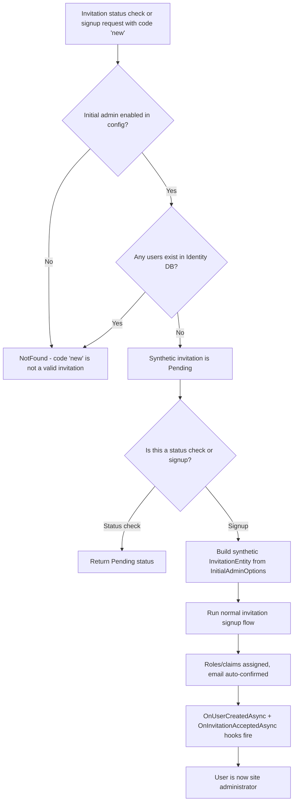
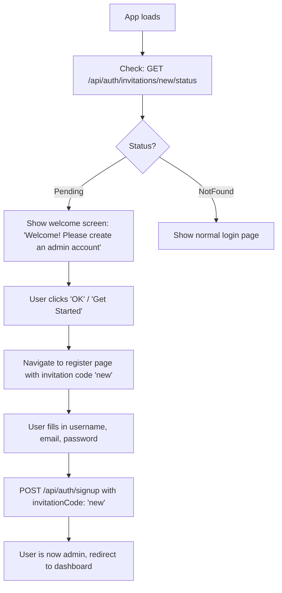
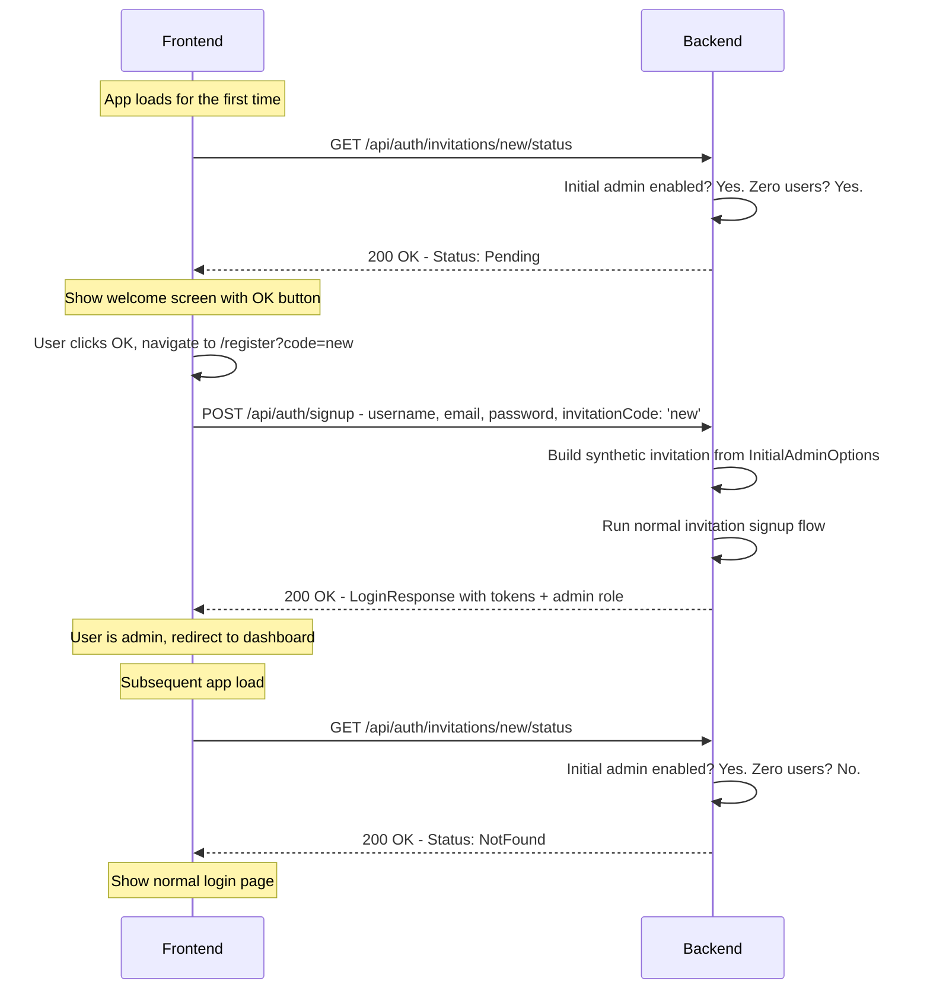

# Product Requirements Document: Initial Admin User

## Problem Statement

Applications built with NuxtIdentity need a way to establish an initial site administrator. Today, this is done through configuration-based seeding (hard-coded credentials in `DatabaseExtensions.cs` or config files), which has security and UX drawbacks: passwords end up in config, the admin account exists before anyone interacts with the app, and there's no "first-run experience." Many applications would benefit from a mode where the first person who registers through the normal UI becomes the site administrator, with the application controlling what roles, claims, and metadata that initial admin receives — similar to how many SaaS products handle initial setup.

---

## Goals & Non-Goals

### Goals
- [ ] Allow the first user who registers through the regular signup UI to become the site administrator
- [ ] Let the application developer define what roles, claims, and metadata the initial admin receives (similar to how invitations carry pre-assigned entitlements)
- [ ] Provide backend implementation that integrates with the existing invitation and registration systems
- [ ] Include a reference design (in the playground/samples) showing how a frontend would detect initial-admin mode and present an appropriate welcome/setup screen
- [ ] Work alongside any existing `RegistrationMode` (Open, EmailConfirmation, InvitationOnly) as an orthogonal feature

### Non-Goals
- Will NOT replace configuration-based seeding — this is an additional option for apps that want a first-run wizard experience
- Will NOT provide drop-in frontend components — the library provides the backend API and the developer builds their own first-run UI
- Will NOT manage ongoing admin user creation — after the initial admin is established, further admin accounts are managed through the application's own admin features
- Will NOT seed the initial admin roles/claims itself — the application must seed required roles (e.g., "admin") via config-based seeding or application code before the initial admin registers

---

## Basic Flow

### Backend Decision Logic



### Frontend Experience



---

## User Stories

### Story 1: Developer - Enable initial admin mode
**As a** developer using NuxtIdentity
**I want** to configure my application to support initial admin registration
**So that** the first user who registers becomes the site administrator without needing config-based credentials

**Acceptance Criteria**:
- [ ] The developer opts in by providing an `NuxtIdentity:InitialAdmin` section in `IConfiguration` (e.g., appsettings.json) — the presence of the configuration data is the opt-in (no separate `Enabled` flag)
- [ ] `InitialAdminOptions` specifies what roles the initial admin should receive (e.g., `["admin"]`)
- [ ] `InitialAdminOptions` can optionally specify claims and metadata for the initial admin
- [ ] When the `NuxtIdentity:InitialAdmin` config section is absent, the feature is completely off — existing applications are unaffected
- [ ] If `InitialAdminOptions` is provided but `Roles` is empty or null, the library raises a clear configuration error — an initial admin without roles is a misconfiguration
- [ ] Required roles must be seeded before the initial admin can register (the library does not auto-create roles)

### Story 2: Frontend - Detect initial admin mode
**As a** frontend developer building a first-run experience
**I want** to detect whether the application is in initial-admin mode
**So that** I can display an appropriate welcome/setup screen instead of the normal login page

**Acceptance Criteria**:
- [ ] The frontend can discover that initial admin registration is available using an existing or new API endpoint
- [ ] When no users exist and initial admin is enabled, the endpoint indicates the initial admin invitation is available (Pending)
- [ ] When users already exist, the endpoint indicates the initial admin invitation is not available (NotFound)
- [ ] The endpoint does not require authentication (since no users exist yet)

### Story 3: User - Register as initial admin
**As a** person setting up a new application instance
**I want** to register through the normal signup flow and become the site administrator
**So that** I can start managing the application immediately

**Acceptance Criteria**:
- [ ] The user registers through `POST /api/auth/signup` with the initial admin invitation code
- [ ] The normal invitation-based registration flow executes: user is created, roles/claims from the invitation are assigned, email is auto-confirmed
- [ ] The `OnUserCreatedAsync` and `OnInvitationAcceptedAsync` hooks fire as with any invitation signup
- [ ] After successful registration, the user receives a login response with tokens and their admin role/claims
- [ ] The initial admin invitation is no longer available after this registration (subsequent checks return NotFound)

### Story 4: Security - Initial admin cannot be created when users exist
**As a** developer using NuxtIdentity
**I want** the initial admin registration path to be unavailable when any users exist in the system
**So that** the feature cannot be exploited after initial setup

**Acceptance Criteria**:
- [ ] If any users exist in the Identity database, the initial admin invitation resolves to NotFound
- [ ] Attempting to sign up with the initial admin invitation code when users exist returns an appropriate error
- [ ] If all users are deleted (e.g., during testing or database reset), the initial admin invitation becomes available again

### Story 5: Developer - Reference sample application
**As a** developer building an application with NuxtIdentity
**I want** a reference sample showing the initial admin flow
**So that** I understand how to build my own first-run experience

**Acceptance Criteria**:
- [ ] A new dedicated sample application demonstrates the initial admin flow (separate from the existing Local sample)
- [ ] The sample includes: detecting initial admin mode, displaying a welcome screen, handling the registration, and transitioning to normal operation
- [ ] The sample documents the call flow between frontend and backend
- [ ] The sample's design is subject to a separate design document

---

## Technical Approach

The initial admin feature leverages the existing invitation system with a **synthetic invitation** pattern. When the code `"new"` is used in an invitation status check or signup, the controller intercepts it *before* it reaches `IInvitationService` (which would reject it as a non-GUID). The controller builds a synthetic `InvitationEntity` from the developer's `InitialAdminOptions` configuration, and the rest of the invitation signup flow runs unchanged.

**Why "new" works naturally**: The existing [`EfInvitationService.GetByCodeAsync`](../../src/EntityFrameworkCore/Services/EfInvitationService.cs:153) does `Guid.TryParse(code)` and returns `null` for non-GUID strings. The string `"new"` is not a valid GUID, so it cleanly separates initial admin from real DB-backed invitations. No database records, no schema changes, no collision risk.

**How It Works**:

1. Developer enables initial admin mode and configures roles/claims via `InitialAdminOptions`
2. Frontend checks `GET /api/auth/invitations/new/status` on app load
3. Controller intercepts code `"new"`: checks if initial admin is enabled AND zero users exist → returns `Pending` or `NotFound`
4. If `Pending`, frontend shows a welcome screen: "Welcome to this app, please create an admin account"
5. User clicks through to register page, which includes `invitationCode: "new"` in the signup request
6. Controller intercepts `"new"` in signup: builds a synthetic `InvitationEntity` with roles/claims from config, then runs the existing `SignUpWithInvitationAsync` code path
7. User is created with admin roles/claims, hooks fire, login response returned

**Developer Configuration**:

Registration behavior (code-level, controller override):
```csharp
// RegistrationMode stays in controller code — it has service registration implications
protected override RegistrationOptions RegistrationOptions => new()
{
    Mode = RegistrationMode.InvitationOnly
};
```

Initial admin data (config-level, appsettings.json):
```json
{
  "NuxtIdentity": {
    "InitialAdmin": {
      "Roles": ["admin"],
      "Claims": [
        { "Type": "level", "Value": "super" }
      ],
      "Metadata": "{\"welcomeMessage\": \"You are the first admin!\"}"
    }
  }
}
```

When `NuxtIdentity:InitialAdmin` section is absent or empty, the feature is off — no code changes needed to disable it.

**Frontend Call Flow**:



**Layers Affected**:
- [ ] Frontend (Vue/Nuxt): New dedicated sample application (design TBD separately)
- [X] Controllers (API endpoints): `ValidateInvitation` and `SignUp` enhanced to intercept code `"new"`
- [X] Application (Features/Business logic): Zero-user check, synthetic invitation construction
- [X] Entities (Domain models): `InitialAdminOptions` configuration class
- [ ] Database (Schema changes): None — no new tables, no seeded records

**Key Business Rules**:
1. **Zero-User Guard** — The initial admin invitation is only available (resolves to Pending) when zero users exist in the Identity database. Once any user exists, it resolves to NotFound.
2. **Re-activation on Empty Database** — If all users are deleted (e.g., database reset, testing), the initial admin invitation becomes available again. This simplifies testing and recovery scenarios.
3. **Orthogonal to RegistrationMode** — Initial admin works alongside any `RegistrationMode`. An `InvitationOnly` app can use initial admin for setup, then require invitations for all subsequent users. An `Open` app can use initial admin to ensure the first user gets admin privileges.
4. **Synthetic Invitation** — The initial admin invitation is never stored in the database. It is constructed on-the-fly from `InitialAdminOptions` when code `"new"` is detected. The signup flow uses the same `SignUpWithInvitationAsync` code path, but the invitation entity is synthetic rather than DB-retrieved.
5. **Opt-In via Configuration** — The feature is enabled by providing an `NuxtIdentity:InitialAdmin` section in `IConfiguration` (appsettings.json). When the section is absent or empty, the feature is completely off. No separate `Enabled` flag — the presence of the configuration data is the opt-in. `InitialAdminOptions` is pure data (roles, claims, metadata) and belongs in config, not in controller code.
6. **Roles Must Pre-Exist** — The initial admin feature does not create roles. The developer must ensure roles referenced in `InitialAdminOptions.Roles` are seeded (via config-based seeding, application code, or PRD-SEEDING) before the initial admin registers.
7. **Well-Known Code "new"** — The initial admin invitation uses the fixed code `"new"`. This is not a security secret — the zero-user guard is the security boundary. The non-GUID format naturally separates it from real DB invitations.
8. **No AcceptAsync Call** — Since there is no DB record to mark as accepted, the controller skips `InvitationService.AcceptAsync` for the synthetic invitation. The zero-user guard inherently prevents reuse.
9. **Configuration Validation — Roles Required** — If `InitialAdminOptions` is provided but `Roles` is empty or null, this is a misconfiguration error. The initial admin feature exists to grant admin privileges; providing it without roles would create an ordinary user, which defeats the purpose. The library should fail with a clear error (e.g., at startup or at first use) rather than silently creating a powerless "admin."

**Code Patterns to Follow**:
- Configuration options: [`JwtOptions`](../../src/Core/Configuration/JwtOptions.cs) for options class pattern
- Invitation status: [`NuxtAuthControllerBase.Auth.cs`](../../src/AspNetCore/Controllers/NuxtAuthControllerBase.Auth.cs:301) for `ValidateInvitation` endpoint
- Controller hooks: [`NuxtAuthControllerBase.cs`](../../src/AspNetCore/Controllers/NuxtAuthControllerBase.cs) for virtual method and `RegistrationOptions` pattern
- Invitation signup flow: [`NuxtAuthControllerBase.Auth.cs`](../../src/AspNetCore/Controllers/NuxtAuthControllerBase.Auth.cs:135) for `SignUpWithInvitationAsync`

---

## Open Questions

- [X] **Real vs. virtual invitation**: Should the initial admin invitation be a real DB record or a synthetic entity? **A**: Synthetic. The controller intercepts the code `"new"` before it reaches `IInvitationService`, builds a synthetic `InvitationEntity` from `InitialAdminOptions`, and runs the existing signup flow. No DB record is created, no schema changes needed. The non-GUID code `"new"` naturally separates it from real DB invitations since `EfInvitationService.GetByCodeAsync` rejects non-GUID codes.
- [X] **Invitation code**: Should we use a well-known fixed code or a configurable one? **A**: Fixed code `"new"`. It's simple, memorable, and not a security concern because the zero-user guard is the actual security boundary. The non-GUID format cleanly separates it from real invitations.
- [X] **Configuration mechanism**: Should `RegistrationMode` and `InitialAdminOptions` both move to `IConfiguration`? **A**: Split approach. `RegistrationMode` stays on the controller virtual property because it has code-level implications — `InvitationOnly` requires `IInvitationService` registered at DI time, `EmailConfirmation` requires `IUserNotifier`. Moving it to config creates a disconnect where config says one thing but the code hasn't wired up the necessary services. `InitialAdminOptions` moves to `IConfiguration` (appsettings.json) because it's pure data (role names, claims, metadata) with no service dependencies, and naturally varies per deployment environment. This gives a clean split: **behavior** in code (controller overrides), **data** in config (`IConfiguration`).
- [X] **User count check performance**: Is caching needed for the "zero users" check? **A**: No. The check only runs when code `"new"` is received — not on every invitation status request. At that point in the app's lifecycle there are zero or very few users, so a simple `UserManager.Users.AnyAsync()` is trivially fast. No caching needed.
- [X] **IInvitationService dependency**: Should initial admin require `IInvitationService` to be registered? **A**: No. The synthetic invitation bypasses `IInvitationService` entirely — no DB lookups, no `AcceptAsync`. The role/claim assignment logic uses `UserManager` directly. This is the key benefit of the synthetic approach: initial admin works with just `UserManager` and the base controller, without needing EF Core invitation infrastructure. An app can use initial admin without supporting invitations for anything else.
- [X] **OnInvitationAcceptedAsync hook**: Should `OnInvitationAcceptedAsync` fire for the initial admin signup, or should there be a dedicated hook? **A**: Yes, reuse `OnInvitationAcceptedAsync`. From the developer's perspective, the initial admin follows the invitation flow — the synthetic nature is an implementation detail. The developer's existing hooks work unchanged, and no new hook API surface is needed.

---

## Success Metrics

- A new application instance can be set up by the first user through the registration UI, receiving admin privileges automatically
- A dedicated sample application demonstrates the complete initial admin flow end-to-end
- No configuration-file credentials are needed for the admin account
- The feature integrates cleanly with all three `RegistrationMode` values
- After initial setup, the initial admin path is completely inaccessible to subsequent users
- Deleting all users re-enables the initial admin path (testability)

---

## Dependencies & Constraints

**Dependencies**:
- Roles referenced in `InitialAdminOptions.Roles` must exist in the database before the initial admin registers — the developer seeds them however they prefer (ad-hoc code, PRD-SEEDING library, or any other mechanism)
- ASP.NET Core Identity `UserManager<TUser>` for user creation, role assignment, and user count check

**Explicitly NOT Dependencies**:
- `IInvitationService` / EF Core invitation infrastructure — the synthetic invitation approach means initial admin works without the invitation system. An app can use initial admin without registering `IInvitationService` or including `NuxtIdentity.EntityFrameworkCore`
- PRD-REGISTRATION — the invitation system features are not required for initial admin functionality
- PRD-SEEDING — the seeding library is not required. Roles can be created by any mechanism the developer chooses

**Constraints**:
- Must work with the generic `TUser : IdentityUser` pattern used throughout NuxtIdentity
- Must be fully opt-in — zero impact on existing applications
- Must not require database schema changes
- Must not require `IInvitationService` or EF Core — only `UserManager` is needed
- Must follow the existing virtual method pattern on `NuxtAuthControllerBase` for overridability

---

## Notes & Context

The current playground seeds an admin user with hard-coded credentials in [`DatabaseExtensions.cs`](../../playground/local/Extensions/DatabaseExtensions.cs). This works for development but has drawbacks in production: passwords in config files, no first-run experience, and the admin account exists before anyone interacts with the app.

The initial admin feature provides an alternative for applications that prefer a first-run setup wizard. Both approaches (config seeding and initial admin) coexist — the developer chooses what fits their deployment model. Some apps may use config seeding in CI/testing and initial admin in production.

The design uses a synthetic invitation that *mimics* the invitation flow (same endpoints, same hooks, same frontend patterns) without actually depending on the invitation infrastructure. This means an app can adopt initial admin without registering `IInvitationService` or including EF Core invitation tables — only `UserManager` is needed. The synthetic approach keeps the codebase simple while providing a familiar frontend experience.

**Future Consideration — Constructor Bloat**: Adding `IOptions<InitialAdminOptions>` to `NuxtAuthControllerBase` would be its 9th constructor parameter. The consuming developer's `AuthController` must pass all of these through. This is a growing concern as features are added. Potential future approaches include splitting the base controller into separate controllers by concern (auth, registration, password) or using an aggregate service pattern. This is not blocking for initial admin but is worth addressing as a broader architectural improvement.

**Related Documents**:
- [PRD Registration](PRD-REGISTRATION.md) — invitation system whose patterns this feature mimics
- [PRD Seeding](PRD-SEEDING.md) — configuration-based seeding (complementary approach)
- [PRD Template](PRD-TEMPLATE.md) — structure reference

---

## Handoff Checklist (for AI implementation)

When handing this off for detailed design/implementation:
- [ ] Document stays within PRD scope (WHAT/WHY). If implementation details are needed, they are in a separate Design Document. See [`PRD-GUIDANCE.md`](PRD-GUIDANCE.md).
- [ ] All user stories have clear acceptance criteria
- [ ] Open questions are resolved or documented as design decisions
- [ ] Technical approach section indicates affected layers
- [ ] Code patterns to follow are referenced (links to similar controllers/features)
