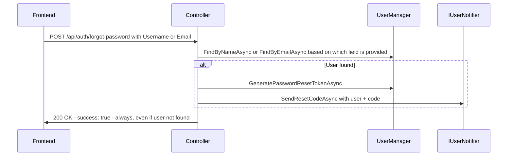
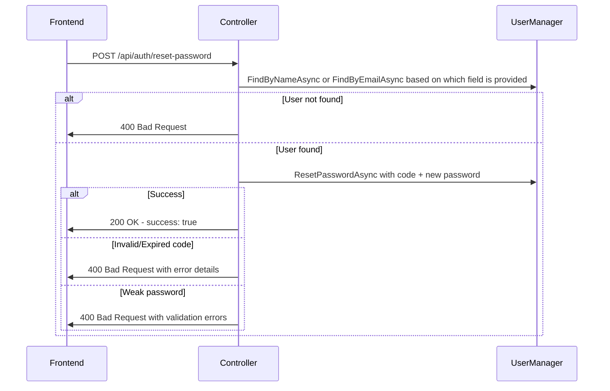

# Product Requirements Document: Password Management

## Problem Statement

NuxtIdentity currently provides login, signup, session, refresh, and logout endpoints but has no support for password management. Users who forget their password have no way to regain access to their account, and logged-in users cannot change their password. These are fundamental authentication features that every consumer application needs, and without them in the library, each consumer must implement password management independently — duplicating boilerplate and risking inconsistent security practices.

---

## Goals & Non-Goals

### Goals
- [ ] Enable users to reset a forgotten password via a code-based flow (forgot password → reset password)
- [ ] Enable logged-in users to change their password by providing their current password
- [ ] Provide a notification abstraction so consumers can deliver reset codes via email, SMS, or any channel
- [ ] Surface ASP.NET Identity password validation errors to the frontend for password strength enforcement
- [ ] Handle expired and invalid reset codes with clear error responses
- [ ] Leverage ASP.NET Identity built-in capabilities (UserManager methods, token providers, password validation) rather than writing custom implementations

### Non-Goals
- Will NOT implement email delivery — the library provides an abstraction that consumers implement
- Will NOT generate reset URLs — the library generates reset codes only; consumers compose URLs for their frontend
- Will NOT format notification content (email body, SMS text, etc.) — the library provides the user object and reset code; consumers craft all messaging, including localization
- Will NOT implement email confirmation in this PRD — however, the `IUserNotifier<TUser>` interface is designed with a `SendEmailConfirmationAsync` method so a future email-confirmation feature can use the same abstraction without refactoring
- Will NOT implement account lockout policies — this is configurable via ASP.NET Identity options, outside the library's scope
- Will NOT provide a UI for password management — this is a backend API library
- Will NOT implement multi-factor authentication as part of this feature

---

## User Stories

### Story 1: User - Request password reset
**As a** user who has forgotten their password
**I want** to request a password reset code
**So that** I can regain access to my account

**Acceptance Criteria**:
- [ ] A `POST /api/auth/forgot-password` endpoint accepts separate optional `Username` and `Email` fields; the consumer populates whichever one their app uses
- [ ] If `Username` is provided, the endpoint looks up the user via `FindByNameAsync`; if `Email` is provided, it uses `FindByEmailAsync`
- [ ] If the user exists, a reset code is generated using ASP.NET Identity's `UserManager.GeneratePasswordResetTokenAsync`
- [ ] The `IUserNotifier` implementation's `SendResetCodeAsync` is called with the user and reset code
- [ ] The endpoint returns a success response regardless of whether the user exists (to prevent user enumeration)
- [ ] The reset code has a limited lifetime governed by ASP.NET Identity's token provider configuration

### Story 2: User - Reset password using code
**As a** user who has received a password reset code
**I want** to set a new password using the reset code
**So that** I can access my account with the new password

**Acceptance Criteria**:
- [ ] A `POST /api/auth/reset-password` endpoint accepts a username or email (same pattern as forgot-password), reset code, and new password
- [ ] The endpoint validates the reset code using ASP.NET Identity's `UserManager.ResetPasswordAsync`
- [ ] On success, a success response is returned (no auto-login; user must log in with new password)
- [ ] If the reset code is invalid or expired, an appropriate error response is returned
- [ ] If the new password does not meet strength requirements, validation errors are returned
- [ ] After a successful reset, the old password no longer works

### Story 3: User - Change password while logged in
**As a** logged-in user
**I want** to change my password from my profile page
**So that** I can update my password for security purposes

**Acceptance Criteria**:
- [ ] A `POST /api/auth/change-password` endpoint accepts the current password and new password
- [ ] The endpoint requires authentication (valid JWT access token)
- [ ] The current password must be verified before the change is applied
- [ ] If the current password is incorrect, an appropriate error response is returned
- [ ] If the new password does not meet strength requirements, validation errors are returned
- [ ] On success, the password is changed and a success response is returned

### Story 4: Consumer Developer - Implement user notifications
**As a** developer consuming NuxtIdentity
**I want** a clear abstraction for delivering notifications to users
**So that** I can integrate my own email/notification service without modifying the library

**Acceptance Criteria**:
- [ ] An `IUserNotifier<TUser>` interface is defined with `SendResetCodeAsync` and `SendEmailConfirmationAsync` methods
- [ ] `SendResetCodeAsync` receives the user object and the reset code string
- [ ] `SendEmailConfirmationAsync` receives the user object and the confirmation code string (for future email confirmation feature)
- [ ] The consumer registers their implementation in DI
- [ ] The forgot-password endpoint calls `SendResetCodeAsync` after generating the code
- [ ] If no notifier is registered, the endpoint still succeeds but generates a warning log

### Story 5: User - Receives clear error for weak password
**As a** user setting a new password (via reset or change)
**I want** to see clear error messages when my password doesn't meet requirements
**So that** I know what to fix

**Acceptance Criteria**:
- [ ] ASP.NET Identity password validation errors are surfaced in the API response
- [ ] Error messages from `IdentityError` descriptions are included in the problem details response
- [ ] Multiple validation failures are returned together (not one at a time)

### Story 6: User - Receives clear error for expired reset code
**As a** user attempting to reset their password
**I want** to see a clear error when my reset code has expired
**So that** I know to request a new one

**Acceptance Criteria**:
- [ ] An expired or invalid reset code returns a 400 Bad Request with a descriptive error
- [ ] The error message distinguishes between "invalid code" and other failures where possible
- [ ] The response follows the existing ProblemDetails format used by other endpoints

### Story 7: Security - Invalidate sessions on password change
**As a** security-conscious system
**I want** all existing refresh tokens to be revoked when a user's password is changed or reset
**So that** compromised sessions cannot persist after a password change

**Acceptance Criteria**:
- [ ] When a password is successfully changed (via change-password or reset-password), all refresh tokens for that user are revoked
- [ ] A new method `RevokeAllUserTokensAsync(string userId)` is added to `IRefreshTokenService`
- [ ] Both `InMemoryRefreshTokenService` and `EfRefreshTokenService` implement the new method
- [ ] The user must re-authenticate (login) to get new tokens after a password change

### Story 8: Developer - Test notification capture for functional tests
**As a** developer writing functional tests for password reset and email confirmation flows
**I want** a built-in test `IUserNotifier<TUser>` implementation that captures notification data
**So that** my functional test runner can retrieve confirmation and reset codes over HTTP without building a custom notification store

**Acceptance Criteria**:
- [ ] NuxtIdentity provides an `InMemoryUserNotifier<TUser>` implementation of `IUserNotifier<TUser>` that captures all notification calls (reset codes, confirmation codes) in memory
- [ ] A query API is provided (e.g., `GetNotificationsAsync(string email)`) to retrieve captured notifications by email address
- [ ] Captured data includes: email address, code, notification type (reset, confirmation), and timestamp
- [ ] The developer registers this implementation in test/dev environments and wraps the query API in a test control endpoint so the functional test runner can retrieve codes over HTTP
- [ ] This is necessary because ASP.NET Identity's codes are generated via data protection token providers — the plaintext code is passed to `IUserNotifier` once and only a hash is stored internally; the code cannot be retrieved after the fact, and regenerating it invalidates the previous one

---

## Technical Approach

The password management feature builds on ASP.NET Identity's built-in password reset and change capabilities (UserManager methods), exposed through new endpoints on `NuxtAuthControllerBase<TUser>`. A new `IUserNotifier<TUser>` interface provides the consumer's hook for delivering notifications (reset codes now, email confirmation in a future PRD).

**New API Endpoints**:

| Method | Path | Auth Required | Description |
|--------|------|---------------|-------------|
| POST | `/api/auth/forgot-password` | No | Generate reset code and notify user |
| POST | `/api/auth/reset-password` | No | Reset password using code |
| POST | `/api/auth/change-password` | Yes | Change password while logged in |

**New Request/Response Models**:

- `ForgotPasswordRequest` — contains separate optional `Username` and `Email` fields; consumer populates whichever their app uses
- `ResetPasswordRequest` — contains separate optional `Username` and `Email` fields (same pattern as forgot-password), reset code, and new password
- `ChangePasswordRequest` — contains current password and new password

Success responses use a simple `{ success: true }` pattern consistent with the existing logout endpoint. Error responses use the existing `ProblemDetails` pattern.

**Notification Abstraction**:

```csharp
namespace NuxtIdentity.Core.Abstractions;

/// <summary>
/// Notifies a user about account-related events.
/// </summary>
/// <typeparam name="TUser">The type of user.</typeparam>
/// <remarks>
/// The consumer implements this interface to deliver notifications however they
/// choose — email, SMS, push notification, etc. The consumer is responsible for
/// composing URLs, message body, localization, and all formatting. The library
/// provides only the user object and the raw codes/tokens.
///
/// If no implementation is registered, endpoints that require notification still
/// succeed but log a warning that no notifier is configured.
///
/// This PRD only uses <see cref="SendResetCodeAsync"/>. The
/// <see cref="SendEmailConfirmationAsync"/> method is included to support a
/// future email confirmation feature without requiring an interface refactor.
/// </remarks>
public interface IUserNotifier<TUser> where TUser : class
{
    /// <summary>
    /// Sends the password reset code to the specified user.
    /// </summary>
    /// <param name="user">The user requesting the password reset.</param>
    /// <param name="resetCode">The reset code generated by ASP.NET Identity.</param>
    Task SendResetCodeAsync(TUser user, string resetCode);

    /// <summary>
    /// Sends the email confirmation code to the specified user.
    /// </summary>
    /// <param name="user">The user whose email needs confirmation.</param>
    /// <param name="confirmationCode">The confirmation code generated by ASP.NET Identity.</param>
    Task SendEmailConfirmationAsync(TUser user, string confirmationCode);
}
```

**Endpoint Flow — Forgot Password**:



**Endpoint Flow — Reset Password**:



**Layers Affected**:
- [ ] Frontend (Vue/Nuxt)
- [X] Controllers (API endpoints): Three new endpoints on `NuxtAuthControllerBase`
- [X] Application (Features/Business logic): `IUserNotifier` interface and default no-op implementation
- [X] Entities (Domain models): New request/response model records
- [ ] Database (Schema changes)

**Key Business Rules**:
1. **No User Enumeration** — The forgot-password endpoint always returns success, even if the user does not exist. This prevents attackers from discovering valid usernames/emails.
2. **Current Password Required** — The change-password endpoint requires the current password for verification, not just authentication. A stolen JWT should not be sufficient to change a password.
3. **Password Validation Pass-Through** — All ASP.NET Identity password validation rules apply. The library surfaces Identity's validation errors directly rather than defining its own password rules.
4. **No Auto-Login After Reset** — After a successful password reset, the user must log in explicitly. This ensures the user confirms they can authenticate with the new credentials.
5. **Reset Code Lifetime** — Reset code expiration is governed by ASP.NET Identity's `DataProtectionTokenProviderOptions.TokenLifespan`, which is configurable by the consumer. The library does not define its own expiration.
6. **Virtual Methods** — All new endpoint methods are `virtual`, following the existing pattern, so consumers can override behavior.

**Code Patterns to Follow**:
- Controller endpoints: [`NuxtAuthControllerBase.cs`](../../src/AspNetCore/Controllers/NuxtAuthControllerBase.cs) for endpoint pattern, logging, and ProblemDetails responses
- Request/Response models: [`AuthModels.cs`](../../src/Core/Models/AuthModels.cs) for record patterns
- Interface abstraction: [`IUserClaimsProvider.cs`](../../src/Core/Abstractions/IUserClaimsProvider.cs) for generic interface pattern
- Testing: NUnit with Gherkin comments (Given/When/Then)

---

## Open Questions

- [X] **Username vs. Email lookup**: The `ForgotPasswordRequest` has separate optional `Username` and `Email` fields. The consumer populates whichever one their app uses. The controller calls `FindByNameAsync` if username is provided, or `FindByEmailAsync` if email is provided. **A**: Separate fields, consumer decides which to populate.
- [X] **Rate limiting**: Not addressed in this PRD. **A**: Non-goal — rate limiting is an infrastructure concern handled by middleware, API gateways, or consumer-level configuration.
- [X] **Invalidate existing sessions on password change/reset**: Should changing or resetting a password invalidate all existing refresh tokens for that user? **A**: Yes, this is a security best practice. Added as Story 7, which may be implemented in a later phase since it requires a new method on `IRefreshTokenService`.

---

## Success Metrics

- Consumer applications can implement full password reset flows using only NuxtIdentity endpoints plus a notification implementation
- The feature file scenarios from the ListsWebApp functional tests can all be implemented against these endpoints
- No custom password management boilerplate is needed in consumer controllers
- Password validation errors from ASP.NET Identity are surfaced clearly to the frontend

---

## Dependencies & Constraints

**Dependencies**:
- ASP.NET Core Identity `UserManager<TUser>` methods: `GeneratePasswordResetTokenAsync`, `ResetPasswordAsync`, `ChangePasswordAsync`
- ASP.NET Core Identity's data protection token provider (used internally for reset code generation and validation)
- Consumer must register an `IUserNotifier<TUser>` implementation for the forgot-password flow to deliver codes

**Constraints**:
- Must work with the generic `TUser : IdentityUser` pattern used throughout NuxtIdentity
- Must follow the existing virtual method pattern on `NuxtAuthControllerBase` for overridability
- Reset code format and lifetime are governed by ASP.NET Identity, not the library
- Must not add email-sending dependencies to the library packages

---

## Notes & Context

This PRD is driven by the functional test scenarios defined in the ListsWebApp project's `Passwords.feature` file, which describes 7 scenarios: requesting a reset link, resetting using a code, logging in after reset, changing password while logged in, weak password validation, expired code handling, and verifying old password no longer works.

The ASP.NET Identity framework already provides the underlying capabilities (`GeneratePasswordResetTokenAsync`, `ResetPasswordAsync`, `ChangePasswordAsync`). This feature wraps those capabilities in NuxtIdentity's API endpoint pattern so they are available to Nuxt frontends through the standard `/api/auth/*` route convention.

**Related Documents**:
- [PRD Template](PRD-TEMPLATE.md)
- [PRD Seeding](PRD-SEEDING.md) — reference for PRD quality and depth
- [PRD Token GUIDs](PRD-TOKEN-GUIDS.md) — reference for PRD format
- [ASP.NET Identity Mapping](../ASPNET-IDENTITY.md) — how Identity data surfaces to the frontend

---

## Handoff Checklist (for AI implementation)

When handing this off for detailed design/implementation:
- [X] Document stays within PRD scope (WHAT/WHY). If implementation details are needed, they are in a separate Design Document. See [`PRD-GUIDANCE.md`](PRD-GUIDANCE.md).
- [X] All user stories have clear acceptance criteria
- [X] Open questions are resolved or documented as design decisions
- [X] Technical approach section indicates affected layers
- [X] Code patterns to follow are referenced (links to similar controllers/features)
