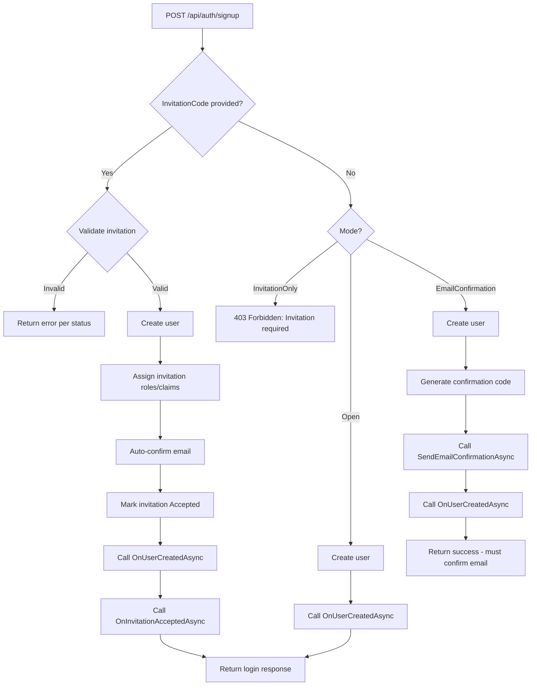

# Product Requirements Document: Registration

## Problem Statement

Users need a way to sign up for an application, and administrators need a way to control who gets access. Today, NuxtIdentity provides only open signup -- anyone can create an account and immediately use the system. Many applications require controlled access: either through administrator-issued invitations that pre-assign roles and entitlements, or through email confirmation that gates access until the user proves ownership of their email address. Without these capabilities in the library, each consuming application must build its own invitation management, email confirmation, and access-control flows from scratch.

---

## Goals & Non-Goals

### Goals
- [ ] Extend the existing signup endpoint to support invitation-based registration, where an invitation code is required and carries pre-assigned roles, claims, and application-defined entitlements
- [ ] Provide email confirmation flow endpoints so consuming apps can require users to verify their email address before gaining full access
- [ ] Provide an `IInvitationService` API so developers can build their own invitation administration experience (create, list, revoke invitations) tailored to their application
- [ ] Maintain the invitation entity in NuxtIdentity with EF Core storage, including lifecycle states (pending, accepted, expired, revoked)
- [ ] Enable developers to control registration behavior through virtual method overrides on the base controller, following the existing extensibility pattern
- [ ] Build on the existing `IUserNotifier<TUser>` interface (from Password Management PRD) for email confirmation correspondence

### Non-Goals
- Will NOT implement email delivery -- the library provides the `IUserNotifier<TUser>` abstraction for email confirmation; consumers implement delivery
- Will NOT deliver invitation notifications -- `IInvitationService.CreateAsync` returns the invitation; the developer is responsible for notifying the recipient through their own mechanism
- Will NOT provide a UI for invitation management or registration -- this is a backend API library
- Will NOT provide admin endpoints for invitation management -- the library provides `IInvitationService` and the developer builds their own admin controller with their own authorization requirements
- Will NOT implement user administration (listing users, assigning roles/claims to existing users) -- that is a separate feature. After registration and confirmation, the developer's `OnUserConfirmedAsync` hook grants baseline access; further entitlement upgrades by an admin are a user-administration concern
- Will NOT manage application-specific entitlements (e.g., list access in ListsWebApp) -- the library provides hooks and metadata for the consuming app to act on
- Will NOT implement rate limiting on registration endpoints -- this is an infrastructure concern

---

## Basic Flow

### Open Registration (current default, enhanced with optional email confirmation)

1. User signs up for an account via `POST /api/auth/signup` (no invitation code)
2. If developer has enabled email confirmation: application sends a confirmation email with a confirmation code via `IUserNotifier`
3. User submits the confirmation code via `POST /api/auth/confirm-email`
4. Developer's `OnUserConfirmedAsync` hook runs, optionally assigning default roles/claims
5. User logs in and uses the application

### Invitation-based Registration

1. Administrator uses an application-specific admin interface that calls `IInvitationService.CreateAsync` to create an invitation, optionally specifying an email address, roles, claims, application-specific metadata, and expiration (all parameters are optional with sensible defaults)
2. The developer delivers the invitation link to the prospective user through their own mechanism (email, in-app notification, etc.)
3. New user navigates to the registration page with the invitation code
4. Frontend validates the invitation code via `PUT /api/auth/invitations/validate` to display appropriate UI
5. User completes registration via `POST /api/auth/signup` with the invitation code
6. NuxtIdentity assigns the roles and claims from the invitation to the new user
7. Developer's `OnInvitationAcceptedAsync` hook runs with the full invitation entity (including metadata) for application-defined entitlement actions
8. User logs in and uses the newly-assigned access

---

## User Stories: Phase 1

### Story 1: User - Register with invitation code
**As a** user who has received an invitation
**I want** to register using the invitation code
**So that** I get an account with the access that was pre-assigned to me

**Acceptance Criteria**:
- [ ] The existing `POST /api/auth/signup` endpoint accepts an optional `InvitationCode` field
- [ ] When a valid invitation code is provided, the user is created and assigned the roles and claims from the invitation
- [ ] After successful registration, the invitation status is updated to "Accepted" so it cannot be reused
- [ ] The `OnInvitationAcceptedAsync` hook is called with the user and the invitation entity (including metadata)
- [ ] The existing `OnUserCreatedAsync` hook is still called for all signups (with or without invitation)

### Story 2: User - Cannot register with invalid invitation
**As a** user attempting to register
**I want** clear error messages when my invitation code is invalid
**So that** I understand why registration failed

**Acceptance Criteria**:
- [ ] An unknown invitation code returns 404 Not Found
- [ ] A previously-used (accepted) invitation returns 400 Bad Request with "invitation has already been used" and suggests signing in
- [ ] An expired invitation returns 400 Bad Request with "invitation has expired"
- [ ] A revoked invitation returns 400 Bad Request with "invitation has been revoked"

### Story 3: Developer - Validate invitation code before registration
**As a** developer building a registration frontend
**I want** to validate an invitation code before showing the registration form
**So that** my frontend can render appropriate UI based on the invitation state

**Acceptance Criteria**:
- [ ] A `PUT /api/auth/invitations/validate` endpoint validates the invitation code (code sent in request body, not URL, because it is a credential)
- [ ] All responses return 200 OK with an `InvitationStatus` enum value — the endpoint always succeeds in answering "what is the status of this code?"
- [ ] For a valid, pending invitation: returns status `Pending` with the invitation email (so the frontend can pre-fill the registration form)
- [ ] For a used (accepted) invitation: returns status `Accepted` — the frontend can suggest signing in instead
- [ ] For an expired invitation: returns status `Expired`
- [ ] For a revoked invitation: returns status `Revoked`
- [ ] For an unknown code: returns status `NotFound`
- [ ] This endpoint does not require authentication

### Story 4: User - Signup rejected without invitation when required
**As a** user attempting to register on an invitation-only application
**I want** to receive a clear rejection when I try to sign up without an invitation code
**So that** I understand that an invitation is required to create an account

**Acceptance Criteria**:
- [ ] The base controller provides a virtual `RegistrationOptions` property that returns configuration including `Mode` (a `RegistrationMode` enum, default: `EmailConfirmation`)
- [ ] When `Mode` is `InvitationOnly`, a signup request without an invitation code returns 403 Forbidden with "invitation required" message
- [ ] When `Mode` is `Open` or `EmailConfirmation`, signup without an invitation code follows the open registration flow

### Story 5: Developer - Create invitations via service API
**As a** developer building an admin interface
**I want** an `IInvitationService` that lets me create invitations programmatically
**So that** I can build an invitation administration experience tailored to my application

**Acceptance Criteria**:
- [ ] An `IInvitationService` interface is provided with a `CreateAsync` method
- [ ] All `CreateAsync` parameters are optional: email address, roles to assign, claims to assign, expiration duration, and application-specific metadata (JSON string)
- [ ] When email is not provided, the invitation is created without an associated email address (the entity stores null)
- [ ] When roles or claims are not provided, they default to empty (no roles/claims assigned on acceptance)
- [ ] When expiration duration is not provided, the invitation defaults to 30 days
- [ ] A unique invitation code is generated and returned
- [ ] The invitation is persisted with status "Pending", including any metadata
- [ ] The developer is responsible for delivering the invitation to the recipient and for building their own admin controller/endpoint with appropriate authorization

### Story 10: Developer - Hook into registration lifecycle
**As a** developer using NuxtIdentity
**I want** lifecycle hooks for key registration events
**So that** I can implement application-specific logic without modifying the library

**Acceptance Criteria**:
- [ ] `OnUserCreatedAsync(TUser user)` -- existing hook, called for all signups (already implemented)
- [ ] `OnInvitationAcceptedAsync(TUser user, Invitation invitation)` -- new hook, called after a user registers with an invitation and roles/claims have been assigned. The invitation entity includes metadata for application-specific actions.
- [ ] `OnUserConfirmedAsync(TUser user)` -- new hook, called after a user's email is confirmed
- [ ] All hooks are `virtual` with no-op default implementations
- [ ] Hooks receive enough context for the consuming app to take action (e.g., the invitation entity includes the assigned roles/claims and metadata)

### Story 13: Developer - Write functional tests
**As a** developer using NuxtIdentity
**I want** to set up all possible situations in my tests
**So that** I can ensure my application behaves correctly in all cases

**Acceptance Critera**
- [ ] When creating an invitation, I can set any available status
- [ ] When creating an invitation for tests, it is uniquely marked as being for testing
- [ ] I can delete all test invitations at once
- [ ] Accounts created from test invitations must match the email in the invitation (ergo an email is required).
- [ ] I can set *all* storable properties of the invitation, including the code itself, except the database ID and the marker denoting it as a test invitation.

## User Stories: Phase 2

### Story 6: Developer - List and query invitations via service API
**As a** developer building an admin interface
**I want** to query invitations through `IInvitationService`
**So that** I can display invitation status in my admin UI

**Acceptance Criteria**:
- [ ] `IInvitationService` provides methods to list invitations and get a single invitation by code
- [ ] Each invitation includes: email, status (via `InvitationStatus` enum), creation date, expiration date, assigned roles/claims, and metadata
- [ ] Invitations can be filtered by `InvitationStatus` enum value (Pending, Accepted, Expired, Revoked)
- [ ] The developer is responsible for building their own admin controller/endpoint with appropriate authorization

### Story 7: Developer - Revoke invitations via service API
**As a** developer building an admin interface
**I want** to revoke invitations through `IInvitationService`
**So that** administrators can cancel pending invitations

**Acceptance Criteria**:
- [ ] `IInvitationService` provides a `RevokeAsync` method that accepts an invitation code
- [ ] The invitation status is updated to `InvitationStatus.Revoked`
- [ ] A revoked invitation cannot be used for registration (returns appropriate error per Story 2)
- [ ] Attempting to revoke an already-accepted or already-revoked invitation returns an appropriate error
- [ ] The developer is responsible for building their own admin controller/endpoint with appropriate authorization

### Story 12: Developer - Seed invitations for testing
**As a** developer using NuxtIdentity
**I want** to seed invitations from configuration at startup
**So that** my test and development environments have predictable invitation codes available

**Acceptance Criteria**:
- [ ] Invitations defined in configuration are created in the Invitations table if they do not exist
- [ ] Seeded invitations support specifying: Code (GUID, required), Email, Roles, Claims, Metadata, and ExpiresIn (duration)
- [ ] The developer provides a predictable Code (GUID) in configuration so that tests and manual workflows can reference it
- [ ] All seeded invitations are created with Pending status — testing non-Pending states (Accepted, Expired, Revoked) is the responsibility of the test controller, not the seeder
- [ ] Seeded invitations follow the same upsert semantics as other seeded data (create if missing, update if different, never delete)
- [ ] The upsert match key is Code — if an invitation with the same Code already exists, it is updated rather than duplicated
- [ ] This story depends on the Identity Seeding feature (PRD-SEEDING) being implemented first
- [ ] The existing seeder is extended with an `Invitations` section rather than building a separate seeding mechanism
- [ ] The seeder never seeds an empty GUID (`00000000-0000-0000-0000-000000000000`). An empty GUID in configuration is treated as a misconfiguration and generates a warning

**Dependency**: Requires [PRD-SEEDING](PRD-SEEDING.md) to be implemented. The seeder will be extended to support an `Invitations` configuration section. The canonical definition of this story now lives in PRD-SEEDING Story 6.

## User Stories: Phase 3

### Story 8: User - Confirm email address
**As a** user who has just registered
**I want** to confirm my email address using a code sent to me
**So that** I can gain full access to the application

**Acceptance Criteria**:
- [ ] A `POST /api/auth/confirm-email` endpoint accepts a username/email and confirmation code
- [ ] The endpoint validates the code using ASP.NET Identity's `UserManager.ConfirmEmailAsync`
- [ ] On success, the user's `EmailConfirmed` flag is set to `true`
- [ ] The `OnUserConfirmedAsync` hook is called, allowing the developer to assign default roles/claims
- [ ] If the code is invalid or expired, an appropriate error response is returned

### Story 9: Developer - Control email confirmation requirement
**As a** developer using NuxtIdentity
**I want** to control whether email confirmation is required for open registration
**So that** I can choose the right balance of security and user experience for my app

**Acceptance Criteria**:
- [ ] The `RegistrationOptions` virtual property includes `Mode` (a `RegistrationMode` enum, default: `EmailConfirmation`)
- [ ] When `Mode` is `EmailConfirmation`, the signup endpoint generates a confirmation code after user creation and calls `IUserNotifier.SendEmailConfirmationAsync`
- [ ] When `Mode` is `Open`, signup behaves as it does today (immediate access, no email confirmation)
- [ ] When `Mode` is `InvitationOnly`, invitation-based registrations auto-confirm the user's email (the invitation itself serves as proof of email access)

### Story 11: Removed

This story is no longer relevant. Preserving the number so we don't need to renumber stories.

---

## Technical Approach

The registration feature extends `NuxtAuthControllerBase<TUser>` with invitation-based signup and email confirmation, following the existing virtual-method extensibility pattern. Invitations are stored via EF Core with a new `Invitation` entity. The developer controls registration behavior through a `RegistrationOptions` virtual property override containing a `RegistrationMode` enum, similar to how Playwright handles `ContextOptions()`.

Invitation administration (create, list, revoke) is provided through an `IInvitationService` API rather than pre-built endpoints. This lets each consuming application build its own admin experience with its own authorization requirements, URL structure, and response formats.

**NuxtIdentity-Provided Endpoints**:

| Method | Path | Auth Required | Description |
|--------|------|---------------|-------------|
| POST | `/api/auth/signup` | No | Extended: accepts optional `InvitationCode` |
| PUT | `/api/auth/invitations/validate` | No | Validate invitation code (frontend pre-check); code in request body |
| POST | `/api/auth/confirm-email` | No | Confirm email address with code |

**Developer-Built Endpoints** (using `IInvitationService`):

The developer creates their own admin controller and injects `IInvitationService` to build invitation management endpoints. Example:

```csharp
// Developer builds their own admin controller
[ApiController]
[Route("api/admin")]
[Authorize(Roles = "admin")] // Developer controls authorization
public class AdminController(IInvitationService invitationService) : ControllerBase
{
    [HttpPost("invitations")]
    public async Task<IActionResult> CreateInvitation(CreateInvitationRequest request)
    {
        // Developer can include app-specific metadata (e.g., list access grants)
        // All parameters are optional — create a bare invitation or a fully-specified one
        var metadata = JsonSerializer.Serialize(new { ListIds = request.ListIds });
        var invitation = await invitationService.CreateAsync(
            email: request.Email, roles: request.Roles, claims: request.Claims,
            expiresIn: request.ExpiresIn, metadata: metadata);
        return Ok(invitation);
    }

    [HttpGet("invitations")]
    public async Task<IActionResult> ListInvitations([FromQuery] InvitationStatus? status)
    {
        var invitations = await invitationService.ListAsync(status);
        return Ok(invitations);
    }

    [HttpDelete("invitations/{code}")]
    public async Task<IActionResult> RevokeInvitation(string code)
    {
        await invitationService.RevokeAsync(code);
        return Ok();
    }
}
```

**Developer Extensibility Pattern**:

```csharp
// Developer overrides in their AuthController
public override RegistrationOptions RegistrationOptions => new()
{
    Mode = RegistrationMode.InvitationOnly
};

protected override Task OnInvitationAcceptedAsync(TUser user, Invitation invitation)
{
    // Access app-specific metadata to grant entitlements
    var metadata = JsonSerializer.Deserialize<MyMetadata>(invitation.Metadata);
    // Grant access to specific lists, etc.
}

protected override Task OnUserConfirmedAsync(TUser user)
{
    // Assign default roles/claims after email confirmation
}
```

**Registration Flow Decision Logic**:



**IInvitationService API**:

```csharp
/// <summary>
/// Invitation validation and lifecycle states.
/// </summary>
public enum InvitationStatus
{
    NotFound,
    Pending,
    Accepted,
    Expired,
    Revoked
}

/// <summary>
/// Service for managing invitation lifecycle.
/// </summary>
public interface IInvitationService
{
    /// <summary>
    /// Creates a new invitation. All parameters are optional with sensible defaults.
    /// </summary>
    /// <param name="email">Optional email address to invite. Null if not applicable.</param>
    /// <param name="roles">Optional roles to assign when the invitation is accepted. Defaults to empty.</param>
    /// <param name="claims">Optional claims to assign when the invitation is accepted. Defaults to empty.</param>
    /// <param name="expiresIn">Optional duration before expiration. Defaults to 30 days.</param>
    /// <param name="metadata">Optional JSON string with application-specific data.</param>
    Task<Invitation> CreateAsync(string? email = null, IReadOnlyList<string>? roles = null,
        IReadOnlyList<ClaimInfo>? claims = null, TimeSpan? expiresIn = null,
        string? metadata = null);

    /// <summary>
    /// Creates an invitation for testing with full control over storable properties.
    /// Id is auto-generated and IsTest is always set to true.
    /// Email is required for test invitations.
    /// </summary>
    Task<Invitation> CreateTestAsync(Invitation invitation);

    /// <summary>
    /// Deletes all invitations marked as test invitations.
    /// </summary>
    Task<int> DeleteTestInvitationsAsync();

    /// <summary>
    /// Gets a single invitation by its code.
    /// </summary>
    Task<Invitation?> GetByCodeAsync(string code);

    /// <summary>
    /// Lists invitations, optionally filtered by status.
    /// </summary>
    Task<IReadOnlyList<Invitation>> ListAsync(InvitationStatus? statusFilter = null);

    /// <summary>
    /// Revokes a pending invitation so it can no longer be used.
    /// </summary>
    Task RevokeAsync(string code);

    /// <summary>
    /// Validates an invitation code and returns the invitation if valid.
    /// </summary>
    Task<Invitation?> ValidateAsync(string code);
}
```

**Layers Affected**:
- [ ] Frontend (Vue/Nuxt)
- [X] Controllers (API endpoints): Extended signup, invitation validation endpoint, confirm-email endpoint
- [X] Application (Features/Business logic): `IInvitationService` interface and `EfInvitationService` implementation, registration options
- [X] Entities (Domain models): `Invitation` entity, `InvitationStatus` enum, `RegistrationMode` enum, new request/response models, `RegistrationOptions`
- [X] Database (Schema changes): New `Invitations` table via EF Core

**High-Level Entity Concepts**:

**InvitationStatus Enum** (new):
- NotFound, Pending, Accepted, Expired, Revoked

**Invitation Entity** (new):
- Id (primary key, auto-generated)
- Code (unique invitation code -- GUID format, required)
- Email (email address of the invited user, optional — null when not applicable)
- Status (`InvitationStatus` enum, required)
- IsTest (boolean, marks test invitations for bulk cleanup and email enforcement, default false)
- Roles (JSON-serialized list of role names to assign, optional)
- Claims (JSON-serialized list of claim type/value pairs to assign, optional)
- Metadata (JSON string for application-specific data, optional -- e.g., list access grants, team assignments)
- CreatedAt (creation timestamp, required)
- ExpiresAt (expiration timestamp, required)
- AcceptedAt (timestamp when used, optional)
- AcceptedByUserId (user ID of the registrant, optional)

**RegistrationMode Enum** (new):
- `Open` — No email confirmation required, anyone can register and immediately use the app
- `EmailConfirmation` — Email confirmation required, anyone can register but must confirm email (default)
- `InvitationOnly` — Invitation required to register, email auto-confirmed via invitation

**RegistrationOptions** (new):
- Mode (`RegistrationMode` enum, default: `EmailConfirmation`)

**Key Business Rules**:
1. **Invitation Single Use** -- Each invitation code can be used exactly once. After successful registration, the status is set to `InvitationStatus.Accepted` and the code cannot be reused.
2. **Invitation Expiration** -- Invitations have a required expiration set at creation time. Expired invitations cannot be used, even if their status is still `Pending`.
3. **Invitation-based Auto-Confirm** -- Users who register with a valid invitation have their email automatically confirmed, since the invitation delivery itself demonstrates email access.
4. **Sensible Defaults** -- By default, `RegistrationMode` is `EmailConfirmation`, providing open-signup with email verification. Developers can switch to `Open` (no email confirmation) or `InvitationOnly` by overriding `RegistrationOptions`. The enum eliminates impossible state combinations.
5. **Role/Claim Transfer** -- Roles and claims defined on the invitation are assigned to the user upon successful registration, before the `OnInvitationAcceptedAsync` hook fires.
6. **Developer-Owned Admin Experience** -- Invitation administration (create, list, revoke) is done through `IInvitationService`. The developer builds their own admin endpoints with their own authorization, URL structure, and response formats.
7. **Virtual Methods** -- All new endpoint methods and hooks are `virtual`, following the existing pattern, so consumers can override behavior.
8. **Metadata Pass-Through** -- The invitation entity carries an optional JSON metadata string that flows from creation through to the `OnInvitationAcceptedAsync` hook. NuxtIdentity stores and delivers this data but does not interpret it -- the consuming app owns the schema and semantics.
9. **Code is a Secret** -- The invitation `Code` is a bearer credential (anyone who has it can register with pre-assigned roles). It must never be logged. Use the invitation's `Id` (auto-generated primary key) for diagnostic logging, following the same pattern as `RefreshTokenEntity.Key`.
10. **Test Invitation Email Enforcement** -- When an invitation has `IsTest = true`, the registering user's email must exactly match the invitation email. This prevents test data from being used with arbitrary accounts. The `IsTest` flag replaces the earlier `__TEST__` email prefix convention. Test invitations require a non-null email at creation time.

**Code Patterns to Follow**:
- Controller endpoints: [`NuxtAuthControllerBase.cs`](../../src/AspNetCore/Controllers/NuxtAuthControllerBase.cs) for endpoint pattern and virtual methods
- Request/Response models: [`AuthModels.cs`](../../src/Core/Models/AuthModels.cs) for record patterns
- Interface abstraction: [`IRefreshTokenService.cs`](../../src/Core/Abstractions/IRefreshTokenService.cs) for service interface pattern
- EF Core service: [`EfRefreshTokenService.cs`](../../src/EntityFrameworkCore/Services/EfRefreshTokenService.cs) for EF-backed service implementation
- Model builder: [`ModelBuilderExtensions.cs`](../../src/EntityFrameworkCore/Extensions/ModelBuilderExtensions.cs) for EF entity configuration
- Testing: NUnit with Gherkin comments (Given/When/Then)

---

## Open Questions

- [X] **Invitation code format**: Should codes be short human-readable slugs, GUIDs, or something else? **A**: GUIDs (`Guid.NewGuid()`). They are built-in to .NET, globally unique with no collision risk, URL-safe, survive email links, and provide 128 bits of entropy against brute-force. Human readability is not needed since codes are delivered via clickable links.
- [X] **Library packaging**: Should invitation management live in `NuxtIdentity.AspNetCore` (alongside the auth controller) or in a new package like `NuxtIdentity.Invitations`? **A**: Keep in the existing three packages. A separate package would create coupling problems — the `SignUp` endpoint in `NuxtAuthControllerBase` needs direct access to invitation types for validation, role/claim assignment, and the `OnInvitationAcceptedAsync` hook. A separate package would force either a circular dependency or clumsy runtime service resolution. Instead, follow the same split used for refresh tokens: `IInvitationService` interface and models in Core, controller endpoints and hooks in AspNetCore, `EfInvitationService` and table configuration in EntityFrameworkCore.
- [X] **Invitation metadata**: Should the invitation entity support an arbitrary metadata/properties bag? **A**: Yes. The `Invitation` entity includes an optional `Metadata` property (JSON string) that the consuming app sets at creation time and reads in the `OnInvitationAcceptedAsync` hook. NuxtIdentity stores and delivers this data but does not interpret it. This supports use cases like "grant access to list X" in ListsWebApp without extending the entity.

---

## Success Metrics

- The Registration.feature scenarios from ListsWebApp.V3 can all be implemented against NuxtIdentity's signup endpoint and `IInvitationService` API
- The RegistrationAdministrationTODO.feature scenarios can be implemented by the consuming app using `IInvitationService`
- A consuming app can switch to invitation-only registration by overriding a single property
- Email confirmation flow works end-to-end when `IUserNotifier` is implemented by the consumer
- Application-specific entitlements (e.g., list access) can be carried through invitation metadata without extending the library

---

## Dependencies & Constraints

**Dependencies**:
- `IUserNotifier<TUser>` interface from Password Management PRD (needed for email confirmation flow; must be implemented first or concurrently)
- ASP.NET Core Identity `UserManager<TUser>` for email confirmation (`GenerateEmailConfirmationTokenAsync`, `ConfirmEmailAsync`)
- Entity Framework Core for invitation persistence

**Constraints**:
- Must work with the generic `TUser : IdentityUser` pattern used throughout NuxtIdentity
- Must follow the existing virtual method pattern on `NuxtAuthControllerBase` for overridability
- Must not add email-sending dependencies to the library packages

---

## Notes & Context

This PRD is driven by the functional test scenarios from the ListsWebApp.V3 project:
- [`Registration.feature`](file:///C:/Source/jcoliz/ListsWebApp.V3/Tests.Functional/Features/V4/Registration.feature) -- covers invitation validation, registration with invitation, invalid/expired/used/revoked invitation scenarios
- [`RegistrationAdministrationTODO.feature`](file:///C:/Source/jcoliz/ListsWebApp.V3/Tests.Functional/Features/RegistrationAdministrationTODO.feature) -- covers admin creating invitations, viewing pending invitations, creating invitations with pre-set access, and revoking invitations

The `OnUserCreatedAsync` hook already exists in the base controller and will continue to fire for all registrations. The new hooks (`OnInvitationAcceptedAsync`, `OnUserConfirmedAsync`) provide additional extensibility points specific to the new flows.

The `IUserNotifier<TUser>` interface was introduced in the Password Management PRD with `SendResetCodeAsync` and `SendEmailConfirmationAsync`. This PRD uses it for email confirmation only. Invitation delivery is the developer's responsibility — `IInvitationService.CreateAsync` returns the invitation with its code, and the developer decides how to deliver it (email, in-app notification, API response, etc.).

The decision to provide `IInvitationService` instead of pre-built admin endpoints gives developers full control over their admin experience -- authorization, URL structure, response formats, and any application-specific logic around invitation creation (e.g., pre-setting list access in ListsWebApp via metadata).

**Functional Testing Pattern**: Functional tests run on a separate machine and communicate with the backend over HTTP only. ASP.NET Identity's confirmation and reset codes are generated via data protection token providers — the plaintext code is passed to `IUserNotifier` once and only a hash is stored internally. The code cannot be retrieved after the fact, and regenerating it invalidates the previous one. This makes the `IUserNotifier` implementation the **only point** where the plaintext code can be captured.

For email confirmation testing, this PRD depends on the `InMemoryUserNotifier<TUser>` defined in [PRD-PASSWORD-MANAGEMENT Story 8](PRD-PASSWORD-MANAGEMENT.md). The developer registers the test notifier in their backend's test environment and wraps its query API in a test control endpoint so the functional test runner can retrieve captured codes over HTTP.

For invitation testing, no email interception is needed — `IInvitationService.CreateAsync` returns the invitation code directly through the developer's admin endpoint response.

**Related Documents**:
- [PRD Password Management](PRD-PASSWORD-MANAGEMENT.md) -- defines `IUserNotifier<TUser>` interface
- [PRD Seeding](PRD-SEEDING.md) -- reference for PRD quality
- [PRD Template](PRD-TEMPLATE.md) -- structure reference
- [ASP.NET Identity Mapping](../ASPNET-IDENTITY.md) -- how Identity data surfaces to the frontend

---

## Handoff Checklist (for AI implementation)

When handing this off for detailed design/implementation:
- [X] Document stays within PRD scope (WHAT/WHY). If implementation details are needed, they are in a separate Design Document. See [`PRD-GUIDANCE.md`](PRD-GUIDANCE.md).
- [X] All user stories have clear acceptance criteria
- [X] Open questions are resolved or documented as design decisions
- [X] Technical approach section indicates affected layers
- [X] Code patterns to follow are referenced (links to similar controllers/features)
