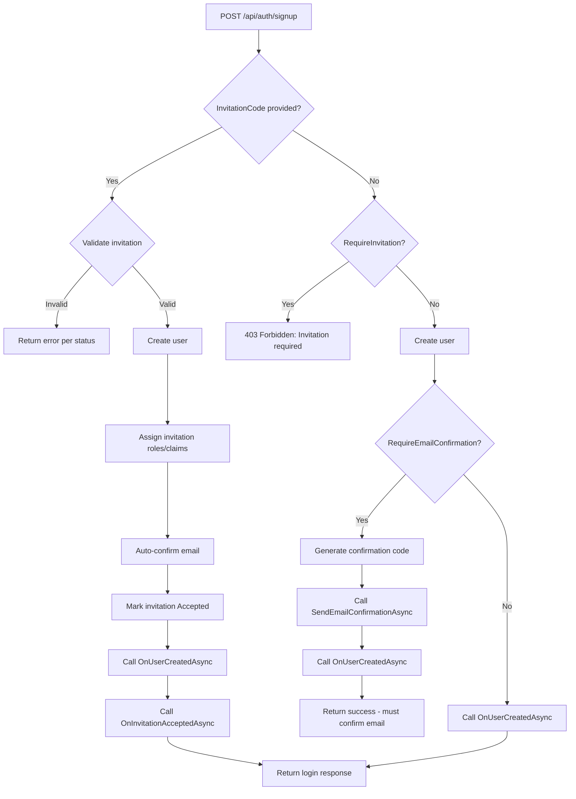

# Product Requirements Document: Registration

## Problem Statement

Users need a way to sign up for an application, and administrators need a way to control who gets access. Today, NuxtIdentity provides only open signup -- anyone can create an account and immediately use the system. Many applications require controlled access: either through administrator-issued invitations that pre-assign roles and entitlements, or through email confirmation that gates access until the user proves ownership of their email address. Without these capabilities in the library, each consuming application must build its own invitation management, email confirmation, and access-control flows from scratch.

---

## Goals & Non-Goals

### Goals
- [ ] Extend the existing signup endpoint to support invitation-based registration, where an invitation code is required and carries pre-assigned roles, claims, and application-defined entitlements
- [ ] Provide email confirmation flow endpoints so consuming apps can require users to verify their email address before gaining full access
- [ ] Provide invitation administration endpoints so administrators can create, view, and revoke invitations
- [ ] Own the invitation entity in NuxtIdentity with EF Core storage, including lifecycle states (pending, accepted, expired, revoked)
- [ ] Enable developers to control registration behavior through virtual method overrides on the base controller, following the existing extensibility pattern
- [ ] Build on the existing `IUserNotifier<TUser>` interface (from Password Management PRD) for all email correspondence (invitation emails, confirmation emails)

### Non-Goals
- Will NOT implement email delivery -- the library provides the `IUserNotifier<TUser>` abstraction; consumers implement delivery
- Will NOT provide a UI for invitation management or registration -- this is a backend API library
- Will NOT implement user administration (listing users, assigning roles/claims to existing users) -- that is a separate feature. After registration and confirmation, the developer's `OnUserConfirmedAsync` hook grants baseline access; further entitlement upgrades by an admin are a user-administration concern
- Will NOT manage application-specific entitlements (e.g., list access in ListsWebApp) -- the library provides hooks for the consuming app to act on
- Will NOT implement rate limiting on registration endpoints -- this is an infrastructure concern

---

## Basic Flow

### Open Registration (current default, enhanced with optional email confirmation)

1. User signs up for an account via `POST /api/auth/signup` (no invitation code)
2. If developer has enabled email confirmation: application sends a confirmation email with a confirmation code via `IUserNotifier`
3. User submits the confirmation code via `POST /api/auth/confirm-email`
4. Developer's `OnUserConfirmedAsync` hook runs, optionally assigning default roles/claims
5. User logs in and uses the application

### Invitation-based Registration

1. Administrator creates an invitation via `POST /api/auth/invitations`, specifying an email address, roles, claims, and expiration
2. `IUserNotifier.SendInvitationAsync` is called -- the consuming app delivers the invitation link to the prospective user
3. New user navigates to the registration page with the invitation code
4. Frontend validates the invitation code via `GET /api/auth/invitations/{code}` to display appropriate UI
5. User completes registration via `POST /api/auth/signup` with the invitation code
6. NuxtIdentity assigns the roles and claims from the invitation to the new user
7. Developer's `OnInvitationAcceptedAsync` hook runs for application-defined entitlement actions
8. User logs in and uses the newly-assigned access

---

## User Stories

### Story 1: User - Register with invitation code
**As a** user who has received an invitation
**I want** to register using the invitation code
**So that** I get an account with the access that was pre-assigned to me

**Acceptance Criteria**:
- [ ] The existing `POST /api/auth/signup` endpoint accepts an optional `InvitationCode` field
- [ ] When a valid invitation code is provided, the user is created and assigned the roles and claims from the invitation
- [ ] After successful registration, the invitation status is updated to "Accepted" so it cannot be reused
- [ ] The `OnInvitationAcceptedAsync` hook is called with the user and the invitation entity
- [ ] The existing `OnUserCreatedAsync` hook is still called for all signups (with or without invitation)

### Story 2: User - Cannot register with invalid invitation
**As a** user attempting to register
**I want** clear error messages when my invitation code is invalid
**So that** I understand why registration failed

**Acceptance Criteria**:
- [ ] An unknown invitation code returns 404 Not Found
- [ ] A previously-used (accepted) invitation returns 400 Bad Request with "invitation has already been used" and suggests signing in
- [ ] An expired invitation returns 400 Bad Request with "invitation has expired"
- [ ] A revoked invitation returns 400 Bad Request with "invitation has been revoked"

### Story 3: User - Validate invitation code before registration
**As a** frontend application
**I want** to validate an invitation code before showing the registration form
**So that** users see appropriate UI messages (errors, or a pre-filled registration form)

**Acceptance Criteria**:
- [ ] A `GET /api/auth/invitations/{code}` endpoint validates the invitation code
- [ ] For a valid, pending invitation: returns 200 OK with the invitation email (so the frontend can pre-fill)
- [ ] For an unknown code: returns 404 Not Found
- [ ] For a used invitation: returns 400 Bad Request with "already used" message
- [ ] For an expired invitation: returns 400 Bad Request with "expired" message
- [ ] For a revoked invitation: returns 400 Bad Request with "revoked" message
- [ ] This endpoint does not require authentication

### Story 4: User - Signup rejected without invitation when required
**As a** developer who requires invitation-based registration
**I want** signup without an invitation code to be rejected
**So that** only invited users can create accounts

**Acceptance Criteria**:
- [ ] The base controller provides a virtual `RegistrationOptions` property that returns configuration including `RequireInvitation` (default: `false`)
- [ ] When `RequireInvitation` is `true`, a signup request without an invitation code returns 403 Forbidden with "invitation required" message
- [ ] When `RequireInvitation` is `false`, signup without an invitation code follows the open registration flow

### Story 5: Administrator - Create invitation
**As an** administrator
**I want** to create invitations for new users
**So that** I can control who has access and what roles they receive

**Acceptance Criteria**:
- [ ] A `POST /api/auth/invitations` endpoint creates a new invitation (requires authentication and authorization)
- [ ] The request includes: email address, roles to assign, claims to assign, and expiration duration
- [ ] A unique invitation code is generated and returned in the response
- [ ] `IUserNotifier.SendInvitationAsync` is called with the user-facing invitation details and code
- [ ] The invitation is persisted with status "Pending"
- [ ] If no `IUserNotifier` is registered, the endpoint still succeeds but logs a warning

### Story 6: Administrator - View pending invitations
**As an** administrator
**I want** to view all pending invitations
**So that** I can track who has been invited and the status of each invitation

**Acceptance Criteria**:
- [ ] A `GET /api/auth/invitations` endpoint returns a list of invitations (requires authentication and authorization)
- [ ] Each invitation includes: email, status (Pending/Accepted/Expired/Revoked), creation date, expiration date, and assigned roles/claims
- [ ] The list can be filtered by status

### Story 7: Administrator - Revoke invitation
**As an** administrator
**I want** to revoke a pending invitation
**So that** the invitation can no longer be used

**Acceptance Criteria**:
- [ ] A `DELETE /api/auth/invitations/{code}` endpoint revokes an invitation (requires authentication and authorization)
- [ ] The invitation status is updated to "Revoked"
- [ ] A revoked invitation cannot be used for registration (returns appropriate error per Story 2)
- [ ] Attempting to revoke an already-accepted or already-revoked invitation returns an appropriate error

### Story 8: User - Confirm email address
**As a** user who has just registered
**I want** to confirm my email address using a code sent to me
**So that** I can gain full access to the application

**Acceptance Criteria**:
- [ ] A `POST /api/auth/confirm-email` endpoint accepts a username/email and confirmation code
- [ ] The endpoint validates the code using ASP.NET Identity's `UserManager.ConfirmEmailAsync`
- [ ] On success, the user's `EmailConfirmed` flag is set to `true`
- [ ] The `OnUserConfirmedAsync` hook is called, allowing the developer to assign default roles/claims
- [ ] If the code is invalid or expired, an appropriate error response is returned

### Story 9: Developer - Control email confirmation requirement
**As a** developer using NuxtIdentity
**I want** to control whether email confirmation is required for open registration
**So that** I can choose the right balance of security and user experience for my app

**Acceptance Criteria**:
- [ ] The `RegistrationOptions` virtual property includes `RequireEmailConfirmation` (default: `false`)
- [ ] When `RequireEmailConfirmation` is `true`, the signup endpoint generates a confirmation code after user creation and calls `IUserNotifier.SendEmailConfirmationAsync`
- [ ] When `false`, signup behaves as it does today (immediate access)
- [ ] Invitation-based registrations auto-confirm the user's email (the invitation itself serves as proof of email access)

### Story 10: Developer - Hook into registration lifecycle
**As a** developer using NuxtIdentity
**I want** lifecycle hooks for key registration events
**So that** I can implement application-specific logic without modifying the library

**Acceptance Criteria**:
- [ ] `OnUserCreatedAsync(TUser user)` -- existing hook, called for all signups (already implemented)
- [ ] `OnInvitationAcceptedAsync(TUser user, Invitation invitation)` -- new hook, called after a user registers with an invitation and roles/claims have been assigned
- [ ] `OnUserConfirmedAsync(TUser user)` -- new hook, called after a user's email is confirmed
- [ ] All hooks are `virtual` with no-op default implementations
- [ ] Hooks receive enough context for the consuming app to take action (e.g., the invitation entity includes the assigned roles/claims)

### Story 11: Consumer Developer - Deliver invitation notifications
**As a** developer consuming NuxtIdentity
**I want** a clear abstraction for delivering invitation notifications to users
**So that** I can integrate my own email/notification service

**Acceptance Criteria**:
- [ ] The existing `IUserNotifier<TUser>` interface is extended with a `SendInvitationAsync` method
- [ ] `SendInvitationAsync` receives the email address and the invitation code
- [ ] The consuming app is responsible for composing URLs, email body, and all formatting
- [ ] If no notifier is registered, the invitation creation endpoint still succeeds but logs a warning

---

## Technical Approach

The registration feature extends `NuxtAuthControllerBase<TUser>` with invitation management and email confirmation, following the existing virtual-method extensibility pattern. Invitations are stored via EF Core with a new `Invitation` entity. The developer controls registration behavior through a `RegistrationOptions` virtual property override, similar to how Playwright handles `ContextOptions()`.

**New/Modified API Endpoints**:

| Method | Path | Auth Required | Description |
|--------|------|---------------|-------------|
| POST | `/api/auth/signup` | No | Extended: accepts optional `InvitationCode` |
| GET | `/api/auth/invitations/{code}` | No | Validate invitation code (frontend pre-check) |
| POST | `/api/auth/invitations` | Yes (Admin) | Create a new invitation |
| GET | `/api/auth/invitations` | Yes (Admin) | List invitations with status filter |
| DELETE | `/api/auth/invitations/{code}` | Yes (Admin) | Revoke an invitation |
| POST | `/api/auth/confirm-email` | No | Confirm email address with code |

**Developer Extensibility Pattern**:

```csharp
// Developer overrides in their AuthController
public override RegistrationOptions RegistrationOptions => new()
{
    RequireInvitation = true,
    RequireEmailConfirmation = false
};

protected override Task OnInvitationAcceptedAsync(TUser user, Invitation invitation)
{
    // Grant application-specific entitlements based on invitation data
}

protected override Task OnUserConfirmedAsync(TUser user)
{
    // Assign default roles/claims after email confirmation
}
```

**Registration Flow Decision Logic**:



**IUserNotifier Extension**:

The existing `IUserNotifier<TUser>` interface (from Password Management PRD) gains one new method:

```csharp
/// <summary>
/// Sends an invitation to the specified email address.
/// </summary>
/// <param name="email">The email address to send the invitation to.</param>
/// <param name="invitationCode">The invitation code for registration.</param>
/// <param name="roles">The roles that will be assigned upon registration.</param>
Task SendInvitationAsync(string email, string invitationCode, IReadOnlyList<string> roles);
```

**Layers Affected**:
- [ ] Frontend (Vue/Nuxt)
- [X] Controllers (API endpoints): Extended signup, new invitation CRUD, new confirm-email
- [X] Application (Features/Business logic): `IInvitationService`, `IUserNotifier` extension, registration options
- [X] Entities (Domain models): `Invitation` entity, new request/response models, `RegistrationOptions`
- [X] Database (Schema changes): New `Invitations` table via EF Core

**High-Level Entity Concepts**:

**Invitation Entity** (new):
- Id (primary key, auto-generated)
- Code (unique invitation code, required)
- Email (email address of the invited user, required)
- Status (Pending/Accepted/Expired/Revoked, required)
- Roles (JSON-serialized list of role names to assign, optional)
- Claims (JSON-serialized list of claim type/value pairs to assign, optional)
- CreatedAt (creation timestamp, required)
- ExpiresAt (expiration timestamp, required)
- AcceptedAt (timestamp when used, optional)
- AcceptedByUserId (user ID of the registrant, optional)

**RegistrationOptions** (new):
- RequireInvitation (whether signup requires an invitation code, default: false)
- RequireEmailConfirmation (whether open signups require email confirmation, default: false)

**Key Business Rules**:
1. **Invitation Single Use** -- Each invitation code can be used exactly once. After successful registration, the status is set to "Accepted" and the code cannot be reused.
2. **Invitation Expiration** -- Invitations have a required expiration set at creation time. Expired invitations cannot be used, even if their status is still "Pending."
3. **Invitation-based Auto-Confirm** -- Users who register with a valid invitation have their email automatically confirmed, since the invitation delivery itself demonstrates email access.
4. **Sensible Defaults** -- By default, `RequireInvitation` is `false` and `RequireEmailConfirmation` is `false`, providing open-signup behavior. Developers opt into restricted registration by overriding `RegistrationOptions`.
5. **Role/Claim Transfer** -- Roles and claims defined on the invitation are assigned to the user upon successful registration, before the `OnInvitationAcceptedAsync` hook fires.
6. **Admin-Only Invitation Management** -- Creating, listing, and revoking invitations requires authentication and administrator authorization. The consuming app controls which roles qualify as "administrator" through standard ASP.NET Core authorization.
7. **Virtual Methods** -- All new endpoint methods and hooks are `virtual`, following the existing pattern, so consumers can override behavior.

**Code Patterns to Follow**:
- Controller endpoints: [`NuxtAuthControllerBase.cs`](../../src/AspNetCore/Controllers/NuxtAuthControllerBase.cs) for endpoint pattern and virtual methods
- Request/Response models: [`AuthModels.cs`](../../src/Core/Models/AuthModels.cs) for record patterns
- Interface abstraction: [`IRefreshTokenService.cs`](../../src/Core/Abstractions/IRefreshTokenService.cs) for service interface pattern
- EF Core service: [`EfRefreshTokenService.cs`](../../src/EntityFrameworkCore/Services/EfRefreshTokenService.cs) for EF-backed service implementation
- Model builder: [`ModelBuilderExtensions.cs`](../../src/EntityFrameworkCore/Extensions/ModelBuilderExtensions.cs) for EF entity configuration
- Testing: NUnit with Gherkin comments (Given/When/Then)

---

## Open Questions

- [ ] **Authorization for invitation admin endpoints**: Should the library require a specific role (e.g., "admin") or use a policy name that the consumer configures? The consuming app may have different role names for administrators.
- [ ] **Invitation code format**: Should codes be short human-readable slugs (e.g., 8-character alphanumeric), GUIDs, or something else? Short codes are easier in URLs but less secure against brute-force guessing.
- [ ] **Library packaging**: Should invitation management live in `NuxtIdentity.AspNetCore` (alongside the auth controller) or in a new package like `NuxtIdentity.Invitations`? The EF Core entity will need to be in `NuxtIdentity.EntityFrameworkCore`.
- [ ] **Invitation metadata**: Should the invitation entity support an arbitrary metadata/properties bag so consuming apps can attach application-specific data (e.g., "grant access to list X") without extending the entity?

---

## Success Metrics

- The Registration.feature scenarios from ListsWebApp.V3 can all be implemented against NuxtIdentity's endpoints without custom invitation management code in the consuming app
- The RegistrationAdministrationTODO.feature scenarios can be implemented using the invitation admin endpoints
- A consuming app can switch to invitation-only registration by overriding a single property
- Email confirmation flow works end-to-end when `IUserNotifier` is implemented by the consumer

---

## Dependencies & Constraints

**Dependencies**:
- `IUserNotifier<TUser>` interface from Password Management PRD (must be implemented first or concurrently)
- ASP.NET Core Identity `UserManager<TUser>` for email confirmation (`GenerateEmailConfirmationTokenAsync`, `ConfirmEmailAsync`)
- Entity Framework Core for invitation persistence
- ASP.NET Core authorization for admin endpoints

**Constraints**:
- Must work with the generic `TUser : IdentityUser` pattern used throughout NuxtIdentity
- Must follow the existing virtual method pattern on `NuxtAuthControllerBase` for overridability
- Must not add email-sending dependencies to the library packages
- Invitation admin endpoints need flexible authorization -- different consuming apps may have different admin role names

---

## Notes & Context

This PRD is driven by the functional test scenarios from the ListsWebApp.V3 project:
- [`Registration.feature`](file:///C:/Source/jcoliz/ListsWebApp.V3/Tests.Functional/Features/V4/Registration.feature) -- covers invitation validation, registration with invitation, invalid/expired/used/revoked invitation scenarios
- [`RegistrationAdministrationTODO.feature`](file:///C:/Source/jcoliz/ListsWebApp.V3/Tests.Functional/Features/RegistrationAdministrationTODO.feature) -- covers admin creating invitations, viewing pending invitations, creating invitations with pre-set access, and revoking invitations

The `OnUserCreatedAsync` hook already exists in the base controller and will continue to fire for all registrations. The new hooks (`OnInvitationAcceptedAsync`, `OnUserConfirmedAsync`) provide additional extensibility points specific to the new flows.

The `IUserNotifier<TUser>` interface was introduced in the Password Management PRD with `SendResetCodeAsync` and `SendEmailConfirmationAsync`. This PRD adds `SendInvitationAsync` to the same interface, keeping all user notification concerns in one abstraction.

**Related Documents**:
- [PRD Password Management](PRD-PASSWORD-MANAGEMENT.md) -- defines `IUserNotifier<TUser>` interface
- [PRD Seeding](PRD-SEEDING.md) -- reference for PRD quality
- [PRD Template](PRD-TEMPLATE.md) -- structure reference
- [ASP.NET Identity Mapping](../ASPNET-IDENTITY.md) -- how Identity data surfaces to the frontend

---

## Handoff Checklist (for AI implementation)

When handing this off for detailed design/implementation:
- [X] Document stays within PRD scope (WHAT/WHY). If implementation details are needed, they are in a separate Design Document. See [`PRD-GUIDANCE.md`](PRD-GUIDANCE.md).
- [X] All user stories have clear acceptance criteria
- [ ] Open questions are resolved or documented as design decisions
- [X] Technical approach section indicates affected layers
- [X] Code patterns to follow are referenced (links to similar controllers/features)
