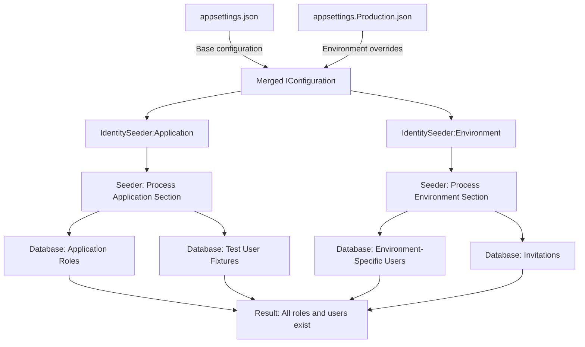

# Identity Seeding Configuration Architecture - Summary & Recommendations

## Executive Summary

This document summarizes the architectural solution for the Identity Seeding configuration namespace conflict discovered in the NuxtIdentity library PRD.

**Problem**: Two distinct use cases (application-level test fixtures vs. environment-specific administrators) need separate configuration namespaces because ASP.NET configuration doesn't merge arrays—environment-specific config overwrites base config.

**Solution**: Two-section configuration structure (`IdentitySeeder:Application` and `IdentitySeeder:Environment`) that naturally avoids the array replacement problem while providing clear separation of concerns.

## The Problem

### Use Cases Identified

1. **Application Developer**: Needs to establish certain roles and claims expected by functional tests
   - Example: "User", "Administrator", "Functional Tests" roles with fixed GUIDs
   - Must be consistent across ALL environments (dev, container, staging, production)
   - Cannot be overwritten by environment-specific configuration

2. **Site Administrator**: When configuring a particular ENVIRONMENT, needs to seed:
   - Site administrators for that specific environment
   - Environment-specific invitation codes
   - Environment-specific roles (if any)

### Root Cause

ASP.NET Core configuration **replaces** arrays when layering configuration files—it does not merge them.

**Example of the problem:**
```json
// appsettings.json
{ "Roles": [{ "Name": "User" }, { "Name": "Admin" }] }

// appsettings.Production.json  
{ "Roles": [{ "Name": "SiteAdmin" }] }

// Result: Only SiteAdmin exists (User and Admin are LOST)
```

### Current Workaround

ListsWebApp.V3 uses separate named `IOptions` sections:
- Unnamed sections (`User`, `Role`) for environment-specific data
- Named section (`DefaultSeeder`) for application-level data
- Manual registration and retrieval of both named and unnamed options
- Verbose and difficult to understand

## The Solution

### Architecture: Two-Section Configuration

```
IdentitySeeder
├── Application (application-level, all environments)
│   ├── Roles (business roles + test roles)
│   ├── Users (test fixtures)
│   ├── RoleClaims
│   └── Invitations (test invitations)
└── Environment (environment-specific)
    ├── Roles (env-specific roles, if any)
    ├── Users (site admins per environment)
    ├── RoleClaims
    └── Invitations (env-specific invitation codes)
```

### Why This Works

1. **Separate Paths**: `Application` and `Environment` are different configuration paths
2. **No Array Conflict**: Environment files can define `IdentitySeeder:Environment:Users` without affecting `IdentitySeeder:Application:Roles`
3. **Natural Merging**: Seeder processes both sections sequentially
4. **Clear Intent**: Configuration structure self-documents the two use cases

### Configuration Example

**appsettings.json** (base - all environments):
```json
{
  "IdentitySeeder": {
    "Application": {
      "Roles": [
        { "Name": "User", "Id": "f7260efe-a5f8-4a5a-850f-a1f2f8725c78" },
        { "Name": "Administrator", "Id": "2722e8dc-2aae-4563-aafd-5320b807ea91" },
        { "Name": "Functional Tests", "Id": "7de7cfd4-572c-4c2a-8fd6-baf9eeec30f2" }
      ]
    },
    "Environment": {}
  }
}
```

**appsettings.Production.json** (environment-specific):
```json
{
  "IdentitySeeder": {
    "Environment": {
      "Users": [
        {
          "UserName": "admin",
          "Email": "admin@production.com",
          "Roles": ["Administrator"]
        }
      ]
    }
  }
}
```

**Result**: Both Application roles (User, Administrator, Functional Tests) AND Environment users (admin) are seeded.

### Implementation Pattern

```csharp
// Service registration (simple - one call)
builder.Services.AddNuxtIdentitySeeding(builder.Configuration);

// Seeding (simple - one call)
await app.SeedNuxtIdentityAsync();

// Internal implementation processes both sections:
// 1. Seed Application section (test fixtures, required roles)
// 2. Seed Environment section (admins, invitations, env-specific data)
```

## Alternatives Considered

### Option B: Merge Control Flag

**Approach**: Single `IdentitySeeder` section with `MergeWithApplicationDefaults: true` flag

**How it would work**:
- Seeder reads merged configuration
- If merge flag detected, traverse `IConfigurationRoot.Providers` to find all layers
- Manually merge arrays across layers

**Why rejected**:
- Significantly more complex implementation
- Requires accessing internal configuration provider details
- Worse performance (layer traversal)
- Less clear configuration structure
- Potential compatibility issues with configuration sources

### Option C: Named IOptions Pattern (Status Quo)

**Current approach in ListsWebApp.V3**

**Why inadequate**:
- Verbose service registration
- Requires understanding of named options pattern
- Configuration structure doesn't self-document intent
- Two separate seeding calls needed
- Not documented in PRD

## Documents Created

### 1. [`seeding-config-namespace-solution.md`](seeding-config-namespace-solution.md)
**Purpose**: Detailed architectural solution specification

**Contents**:
- Problem statement with current workaround analysis
- Selected solution (Option A) with full justification
- Configuration structure and examples
- Use case mapping table
- Alternative considered (Option B) with rejection rationale
- Design decisions
- Impact on PRD

**Audience**: Engineers implementing the solution

### 2. [`PRD-SEEDING-UPDATED.md`](PRD-SEEDING-UPDATED.md)
**Purpose**: Change summary for updating the PRD

**Contents**:
- New user stories (2 added)
- User story renumbering (1-7 → 3-9)
- Technical approach section replacement
- Consumer API updates
- Seeding order updates
- New business rule

**Audience**: Person updating the PRD document

### 3. [`MIGRATION-SEEDING.md`](MIGRATION-SEEDING.md)
**Purpose**: Migration guide from current implementation to library

**Contents**:
- Current implementation analysis
- Migration mapping table
- Step-by-step migration instructions
- Configuration file before/after examples
- Testing migration procedures
- Rollback plan

**Audience**: Developers migrating ListsWebApp.V3 to use the library

## Recommendations

### For NuxtIdentity Library Implementation

1. **Use the two-section approach** (`Application` and `Environment`)
   - Simplest to implement
   - Clearest for users
   - Best long-term maintainability

2. **Process sections sequentially**
   - Application section first (test fixtures, required roles)
   - Environment section second (admins, invitations)
   - Use same upsert semantics for both

3. **Make both sections optional**
   - Allow empty/missing `Application` section (env-specific only use case)
   - Allow empty/missing `Environment` section (test-only use case)
   - Log information about what was seeded from each section

4. **Document the intent clearly**
   - Provide guidance table (as shown in PRD-SEEDING-UPDATED.md)
   - Include migration examples from common patterns
   - Show TOML, JSON, and environment variable examples

### For PRD Updates

1. **Add the two new user stories** at the beginning
   - Story 1: Application Developer - application-wide roles and test fixtures
   - Story 2: Site Administrator - environment-specific seeding

2. **Replace the Technical Approach section** entirely
   - Use content from `PRD-SEEDING-UPDATED.md`
   - Include the usage guidance table
   - Show all three configuration formats (JSON, TOML, env vars)

3. **Update Consumer API section**
   - Show internal processing of both sections
   - Document seeding order

4. **Add new business rule**
   - Two-Section Merging - explain Application-first, then Environment

### For ListsWebApp.V3 Migration (Future)

1. **Wait for library release** - Don't migrate until NuxtIdentity library is implemented and tested

2. **Migrate incrementally**:
   - Step 1: Update configuration files (keeping old code)
   - Step 2: Add library, run parallel (old code + new library)
   - Step 3: Verify both produce same results
   - Step 4: Remove old seeding code
   - Step 5: Keep application-specific seeding (Lists, Access)

3. **Test thoroughly**:
   - Local development
   - Container environment
   - Functional tests
   - Production-like environment (UAT)

## Benefits Summary

| Benefit | Description |
|---------|-------------|
| **Clarity** | Configuration structure self-documents the two use cases |
| **Simplicity** | No custom merge logic, no layer traversal, no complexity |
| **Maintainability** | Clear separation makes future changes easier |
| **Testability** | Application fixtures remain stable across all environments |
| **Flexibility** | Either section can be used independently or together |
| **Migration** | Straightforward path from current implementation |
| **Documentation** | Easy to explain and document for users |

## Mermaid Diagram: Configuration Flow



## Next Steps

1. **Review and approve** this architecture with stakeholders
2. **Update PRD-SEEDING.md** using `PRD-SEEDING-UPDATED.md` as guide
3. **Implement** in NuxtIdentity library following the design
4. **Test** with playground and samples
5. **Document** in library README with examples
6. **Migrate** ListsWebApp.V3 using `MIGRATION-SEEDING.md` when ready

## Questions for Discussion

1. **Section naming**: Are `Application` and `Environment` the right names, or would `Defaults`/`Overrides`, `Fixed`/`Variable`, or other names be clearer?
   - **Recommendation**: Stick with `Application` and `Environment` for alignment with ASP.NET Core patterns

2. **Empty GUID handling**: Should empty GUIDs in Role.Id be allowed (generate random) or rejected (require explicit)?
   - **Recommendation**: Allow empty/null for Environment roles, reject for Application roles (test stability)

3. **Seeding order within sections**: Should there be control over order, or always dependency-based?
   - **Recommendation**: Always dependency-based (Roles → Users → UserRoles → Claims → Invitations)

4. **Configuration validation**: Should library validate config at startup or fail during seeding?
   - **Recommendation**: Validate at service registration time with clear error messages

## Related Documents

- [`PRD-SEEDING.md`](PRD-SEEDING.md) - Original product requirements document
- [`seeding-config-namespace-solution.md`](seeding-config-namespace-solution.md) - Detailed solution architecture
- [`PRD-SEEDING-UPDATED.md`](PRD-SEEDING-UPDATED.md) - Specific changes needed for PRD
- [`MIGRATION-SEEDING.md`](MIGRATION-SEEDING.md) - Migration guide for ListsWebApp.V3
