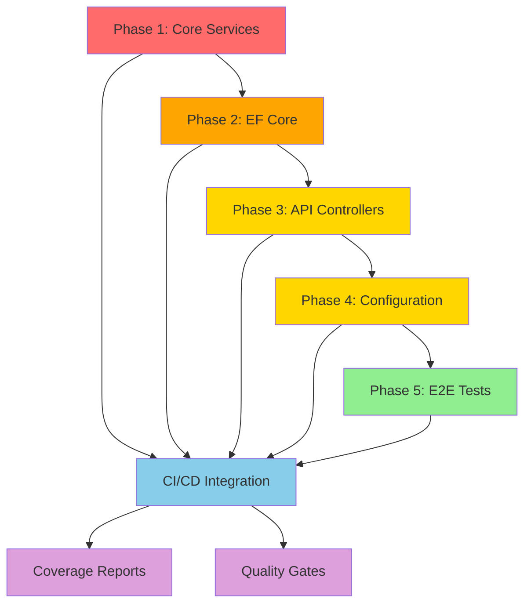

# NuxtIdentity Testing Strategy

## Overview

This document outlines a comprehensive, incremental testing strategy for the NuxtIdentity project. The strategy is designed to build confidence progressively, starting with critical components and expanding to full coverage.

## Current State

**Testing Status:** ❌ No tests currently exist

The project has zero test coverage across all libraries:
- [`NuxtIdentity.Core`](../src/Core/NuxtIdentity.Core.csproj) - Core JWT and refresh token services
- [`NuxtIdentity.AspNetCore`](../src/AspNetCore/NuxtIdentity.AspNetCore.csproj) - ASP.NET Core controllers and extensions
- [`NuxtIdentity.EntityFrameworkCore`](../src/EntityFrameworkCore/NuxtIdentity.EntityFrameworkCore.csproj) - EF Core refresh token persistence
- [`NuxtIdentity.Tenancy`](../src/Tenancy/NuxtIdentity.Tenancy.csproj) - Multi-tenancy support

## Testing Philosophy

### Principles
1. **Security-First**: Authentication and authorization code must be thoroughly tested
2. **Incremental Coverage**: Build tests progressively, starting with highest-risk components
3. **Practical Testing**: Focus on behavior and contracts, not implementation details
4. **Maintainability**: Tests should be clear, focused, and easy to maintain
5. **Fast Feedback**: Unit tests should run in milliseconds; integration tests in seconds

### Testing Pyramid
```
         /\
        /  \  E2E (Minimal - Full flow validation)
       /----\
      /      \  Integration (Moderate - Component interaction)
     /--------\
    /          \  Unit (Extensive - Business logic)
   /____________\
```

## Incremental Implementation Phases

### Phase 1: Foundation - Core Services Unit Tests
**Priority:** 🔴 CRITICAL
**Goal:** Test the security-critical JWT and refresh token services

#### Scope
- [`JwtTokenService<TUser>`](../src/Core/Services/JwtTokenService.cs:46)
  - Token generation with valid claims
  - Token validation (valid/expired/tampered)
  - Clock skew handling
  - Configuration edge cases
- [`InMemoryRefreshTokenService`](../src/Core/Services/InMemoryRefreshTokenService.cs:13)
  - Token generation and validation
  - Token revocation (single and bulk)
  - Expiration handling
  - Concurrent access scenarios
- [`EfRefreshTokenService`](../src/EntityFrameworkCore/Services/EfRefreshTokenService.cs)
  - CRUD operations
  - Database constraint validation
  - Cleanup operations

#### Test Project Structure
```
tests/
├── NuxtIdentity.Core.Tests/
│   ├── Services/
│   │   ├── JwtTokenServiceTests.cs
│   │   └── InMemoryRefreshTokenServiceTests.cs
│   └── NuxtIdentity.Core.Tests.csproj
```

#### Key Test Categories
- ✅ Happy path scenarios
- ❌ Error handling and validation
- ⏱️ Token expiration edge cases
- 🔒 Security boundary testing
- 🧵 Thread safety (for in-memory service)

#### Success Criteria
- All core service methods covered
- Token tampering detected
- Expiration correctly enforced
- Concurrent access safe

---

### Phase 2: Data Layer - EF Core Integration Tests
**Priority:** 🟠 HIGH
**Goal:** Verify Entity Framework integration and data persistence

#### Scope
- [`EfRefreshTokenService`](../src/EntityFrameworkCore/Services/EfRefreshTokenService.cs) with real database
- [`ModelBuilderExtensions`](../src/EntityFrameworkCore/Extensions/ModelBuilderExtensions.cs)
- Database migrations and schema validation

#### Test Project Structure
```
tests/
├── NuxtIdentity.EntityFrameworkCore.Tests/
│   ├── Services/
│   │   └── EfRefreshTokenServiceTests.cs
│   ├── Extensions/
│   │   └── ModelBuilderExtensionsTests.cs
│   └── NuxtIdentity.EntityFrameworkCore.Tests.csproj
```

#### Testing Approach
- Use SQLite in-memory database for fast, isolated tests
- Test database constraints and indexes
- Verify cascade behaviors
- Test migration scenarios

#### Success Criteria
- All EF operations work correctly
- Database constraints enforced
- No N+1 query issues
- Proper transaction handling

---

### Phase 3: API Layer - Controller Integration Tests
**Priority:** 🟡 MEDIUM
**Goal:** Test authentication endpoints and ASP.NET Core integration

#### Scope
- [`NuxtAuthControllerBase<TUser>`](../src/AspNetCore/Controllers/NuxtAuthControllerBase.cs:59) endpoints
  - Login flow
  - Signup flow
  - Token refresh flow
  - Session retrieval
  - Logout
- JWT authentication middleware configuration
- Claims provider integration

#### Test Project Structure
```
tests/
├── NuxtIdentity.AspNetCore.Tests/
│   ├── Controllers/
│   │   └── NuxtAuthControllerTests.cs
│   ├── Configuration/
│   │   └── JwtBearerOptionsSetupTests.cs
│   └── NuxtIdentity.AspNetCore.Tests.csproj
```

#### Testing Approach
- Use `WebApplicationFactory` for in-memory API testing
- Mock Identity framework dependencies
- Test complete HTTP request/response cycles
- Verify ProblemDetails responses
- Test authorization attribute behavior

#### Success Criteria
- All endpoints return correct status codes
- JWT authentication works end-to-end
- Error responses follow RFC 7807
- Authorization correctly enforced

---

### Phase 4: Configuration & Extensions
**Priority:** 🟡 MEDIUM
**Goal:** Verify service registration and configuration

#### Scope
- [`ServiceCollectionExtensions`](../src/AspNetCore/Extensions/ServiceCollectionExtensions.cs) registration
- [`JwtBearerOptionsSetup`](../src/AspNetCore/Configuration/JwtBearerOptionsSetup.cs) configuration
- Options validation

#### Test Project Structure
```
tests/
├── NuxtIdentity.AspNetCore.Tests/
│   ├── Extensions/
│   │   └── ServiceCollectionExtensionsTests.cs
```

#### Success Criteria
- All services registered correctly
- Options validation catches invalid config
- Dependency injection graph resolves

---

### Phase 5: End-to-End Validation
**Priority:** 🟢 LOW
**Goal:** Validate complete authentication flows

#### Scope
- Full user registration → login → protected resource → refresh → logout flow
- Integration with sample applications
- Performance benchmarks

#### Test Project Structure
```
tests/
├── NuxtIdentity.E2E.Tests/
│   ├── Flows/
│   │   ├── AuthenticationFlowTests.cs
│   │   └── TokenRefreshFlowTests.cs
│   └── NuxtIdentity.E2E.Tests.csproj
```

#### Testing Approach
- Use SQLite in-memory database for fast tests
- Test against actual playground/sample apps
- Measure response times and throughput
- Test cross-browser scenarios (if UI involved)

#### Success Criteria
- Complete flows work without errors
- Performance meets acceptable thresholds
- No memory leaks or resource issues

---

## Test Infrastructure Setup

### Required NuGet Packages

#### Core Testing Packages
```xml
<PackageReference Include="NUnit" Version="4.3.1" />
<PackageReference Include="NUnit3TestAdapter" Version="4.6.0" />
<PackageReference Include="Microsoft.NET.Test.Sdk" Version="17.11.1" />
```

#### Mocking & Assertions
```xml
<PackageReference Include="Moq" Version="4.20.72" />
<PackageReference Include="FluentAssertions" Version="6.12.1" />
```

#### ASP.NET Core Testing
```xml
<PackageReference Include="Microsoft.AspNetCore.Mvc.Testing" Version="10.0.0" />
<PackageReference Include="Microsoft.AspNetCore.TestHost" Version="10.0.0" />
```

#### Database Testing
```xml
<PackageReference Include="Microsoft.EntityFrameworkCore.Sqlite" Version="10.0.0" />
<PackageReference Include="Microsoft.EntityFrameworkCore.InMemory" Version="10.0.0" />
```

### Test Fixtures & Helpers

#### Common Test Utilities
- `TestJwtOptions` - Pre-configured JWT settings for tests
- `TestUserFactory` - Create test users with various configurations
- `InMemoryDatabaseFixture` - Shared SQLite database for tests
- `MockIdentityFactory` - Create mock UserManager and SignInManager instances

### CI/CD Integration

#### GitHub Actions Workflow
```yaml
name: Tests
on: [push, pull_request]
jobs:
  test:
    runs-on: ubuntu-latest
    steps:
      - uses: actions/checkout@v4
      - uses: actions/setup-dotnet@v4
        with:
          dotnet-version: '10.0.x'
      - run: dotnet test --configuration Release --logger "trx;LogFileName=test-results.trx"
      - uses: actions/upload-artifact@v4
        if: always()
        with:
          name: test-results
          path: '**/test-results.trx'
```

#### Coverage Reporting
```bash
dotnet test --collect:"XPlat Code Coverage"
dotnet tool install -g dotnet-reportgenerator-globaltool
reportgenerator -reports:**/coverage.cobertura.xml -targetdir:./coverage
```

---

## Testing Standards & Conventions

### Naming Conventions
- Test class: `{ClassUnderTest}Tests.cs`
- Test method: `{MethodName}_{Scenario}_{ExpectedResult}`
- Example: `GenerateAccessTokenAsync_ValidUser_ReturnsValidJwt`

### Test Structure (AAA Pattern)
```csharp
[Test]
public async Task MethodName_Scenario_ExpectedResult()
{
    // Arrange
    var service = CreateService();
    var input = CreateTestInput();

    // Act
    var result = await service.Method(input);

    // Assert
    result.Should().NotBeNull();
    result.Should().BeEquivalentTo(expected);
}
```

### Assertion Libraries
- Use **FluentAssertions** for readability
- Use **NUnit assertions** for simple cases
- Avoid multiple unrelated assertions in single test

### Test Categories
Use categories to organize tests:
```csharp
[Category("Unit")]
[Category("Integration")]
[Category("Security")]
[Category("Performance")]
```

---

## Mermaid: Testing Implementation Flow



---

## Critical Test Scenarios

### Security-Critical Tests
1. **Token Tampering Detection**
   - Modify token signature → should fail validation
   - Modify claims → should fail validation
   - Expired token → should fail validation

2. **Refresh Token Security**
   - Reusing revoked token → should fail
   - Using token for different user → should fail
   - Token rotation → old token invalid after refresh

3. **Authorization**
   - Unauthenticated access → 401
   - Insufficient permissions → 403
   - Valid token → 200

### Edge Cases
1. **Concurrent Access**
   - Multiple token refreshes simultaneously
   - Race conditions in token revocation

2. **Configuration Errors**
   - Missing JWT secret
   - Invalid expiration values
   - Malformed issuer/audience

3. **Database Failures**
   - Connection failures
   - Constraint violations
   - Transaction rollbacks

---

## Coverage Goals

### Minimum Viable Coverage
- **Core Services (Unit Tests):** 100% line coverage target
- **Controllers:** 80-90%+ line coverage
- **Extensions:** 80-90%+ line coverage
- **Overall Project:** 80-90%+ line coverage

### Prioritized Coverage
Focus on high-risk areas first:
1. 🔴 Token generation and validation
2. 🔴 Refresh token operations
3. 🟠 Authentication endpoints
4. 🟡 Configuration and DI
5. 🟢 Helper methods and utilities

---

## Success Metrics

### Phase Completion Criteria
- ✅ All tests pass
- ✅ Coverage goals met
- ✅ CI/CD pipeline green
- ✅ No critical security gaps
- ✅ Performance benchmarks within thresholds

### Quality Gates
- No failing tests in main branch
- Coverage not decreasing with new code
- Security tests always passing
- Integration tests < 10s total runtime
- Unit tests < 2s total runtime

---

## Next Steps

1. **Review & Approve** - Review this strategy and provide feedback
2. **Phase 1 Implementation** - Start with core service unit tests
3. **Iterate** - Complete each phase before moving to next
4. **Automate** - Set up CI/CD as soon as Phase 1 completes
5. **Maintain** - Keep tests updated with code changes

---

## Decisions & Preferences

Based on project requirements:

1. ✅ **Test Framework**: NUnit
2. ✅ **Mocking Library**: Moq
3. ✅ **Coverage Targets**:
   - Unit tests (no data/HTTP): 100%
   - Integration tests: 80-90%
4. ✅ **CI/CD Platform**: GitHub Actions
5. ✅ **Database Strategy**: SQLite in-memory (no LocalDB)
6. ⏸️ **Performance Benchmarks**: Not needed at this time
7. 🔮 **Mutation Testing**: Future phase consideration with Stryker.NET

---

**Last Updated:** 2025-12-13
**Version:** 1.0
**Status:** Awaiting Approval
